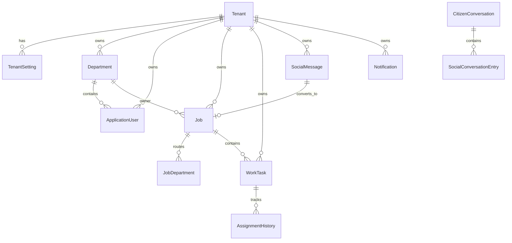

# Veritabanı Tasarım Dokümanı

Hazırlanma tarihi: 18 Haziran 2026

Bu doküman City Communication Center veri modelini, tenant yaklaşımını, migration stratejisini ve temel tablo ilişkilerini açıklar.

## 1. Genel Yaklaşım

Sistem PostgreSQL üzerinde Entity Framework Core ile çalışır. Veri modeli tenant bazlıdır. Çoğu iş entity'si `TenantId` taşır ve EF query filter ile tenant izolasyonu uygular.

Varsayılan provider:

```text
PostgreSQL
```

Opsiyonel migration altyapısı:

```text
SQL Server
```

## 2. DbContext

Ana context:

```text
CityCommunicationCenterDbContext
```

Design-time context'ler:

- `PostgreSqlCityCommunicationCenterDbContext`
- `SqlServerCityCommunicationCenterDbContext`

Runtime context tenant accessor alır ve tenant query filter uygular.

## 3. Ana DbSet'ler

| DbSet | Açıklama |
| --- | --- |
| `Tenants` | Belediye/kurum tenant kayıtları |
| `TenantSettings` | Tenant ayarları |
| `Departments` | Birimler/müdürlükler |
| `Users` | Uygulama kullanıcıları |
| `UserDepartmentAssignments` | Kullanıcı-birim ek ilişkileri |
| `Jobs` | Talep ana kayıtları |
| `JobDepartments` | Talebin ilgili birimleri |
| `Tasks` | Görev kayıtları |
| `Approvals` | Workflow onay kayıtları |
| `AssignmentHistories` | Görev atama geçmişi |
| `SocialMessages` | Sosyal/vatandaş mesajları |
| `CitizenConversations` | Vatandaş konuşma başlıkları |
| `ConversationEntries` | Konuşma mesaj girişleri |
| `WhatsAppTemplates` | WhatsApp mesaj şablonları |
| `Notifications` | Bildirimler |
| `NotificationReadCursors` | Okunmamış bildirim okuma işaretçileri |
| `PushSubscriptions` | Web push abonelikleri |
| `Attachments` | Dosya ekleri |
| `RoutingRules` | Otomatik yönlendirme kuralları |
| `AuditLogs` | Denetim kayıtları |

## 4. Temel İlişki Modeli



## 5. Tenant İzolasyonu

Tenant-scoped entity'ler `TenantId` alanına sahiptir.

Query filter yaklaşımı:

```text
Tenant filter aktifse entity.TenantId == CurrentTenantId
Tenant filter pasifse tüm kayıtlar görülebilir
```

Tenant filter uygulanmış başlıca entity'ler:

- TenantSetting
- Department
- ApplicationUser
- CitizenConversation
- WhatsAppMessageTemplate
- SocialMessage
- Job
- JobDepartment
- WorkTask
- WorkflowApproval
- AssignmentHistory
- Notification
- NotificationReadCursor
- AuditLog
- RoutingRule
- PushSubscription
- Attachment
- UserDepartmentAssignment

## 6. Audit Alanları

Tenant-scoped entity'ler audit alanlarını taşır:

- `CreatedAtUtc`
- `CreatedByUserId`
- `UpdatedAtUtc`
- `UpdatedByUserId`
- `TenantId`

`SaveChangesAsync` sırasında yeni kayıtlar için `CreatedAtUtc`, güncellenen kayıtlar için `UpdatedAtUtc` otomatik set edilir.

## 7. Tenant ve Ayarlar

`Tenant` temel kurum kaydıdır.

`TenantSetting` içinde JSON bazlı konfigürasyonlar bulunur:

- LDAP ayarları
- Authentication policy
- Appearance/theme
- Role page access
- Social media settings
- SMS settings
- File storage settings
- Working hours
- Syslog settings
- SLA weekend settings

Hassas JSON alanları Data Protection ile korunur.

## 8. Kullanıcı ve Birim Modeli

`ApplicationUser`:

- Tenant'a bağlıdır.
- Bir ana departmana sahiptir.
- RoleCode ile yetkilendirilir.
- ManagerUserId ile hiyerarşi kurabilir.
- UserSource ile manuel/LDAP gibi kaynak bilgisini tutar.

`Department`:

- Tenant'a bağlıdır.
- ManagerUserId ile müdür belirtebilir.
- Talep sahibi veya hedef birim olabilir.

`UserDepartmentAssignment`:

- Kullanıcının ek birim ilişkilerini tutar.
- Çok birimli görev/erişim senaryolarını destekler.

## 9. Talep Modeli

`Job` talep ana kaydıdır.

Önemli alanlar:

- `JobId`
- `Title`
- `Description`
- `OwnerDepartmentId`
- `Status`
- `Priority`
- `RequestType`
- `IsProject`
- `StartDateUtc`
- `DueDateUtc`
- `CompletedAtUtc`
- `SourceType`
- `SourceRefId`
- `CancelReason`
- `ManagerNote`
- `CompletionPercentage`
- `IsCoordinated`
- `JobNumber`
- `JobNumberYear`

Adres/konum alanları:

- `Latitude`
- `Longitude`
- `Neighborhood`
- `Street`
- `OpenAddress`

Vatandaş alanları:

- `CitizenName`
- `CitizenPhone`

## 10. Talep Birim İlişkisi

`JobDepartment` talebin birim ilişkilerini tutar.

Roller:

- Owner
- Target
- Coordinating

Bu yapı aynı talebin sahip, hedef ve koordinasyon birimlerini ayrı ayrı modellemeyi sağlar.

## 11. Görev Modeli

`WorkTask` operasyonel görevi temsil eder.

Önemli alanlar:

- `TaskId`
- `JobId`
- `Title`
- `Description`
- `OwnerUserId`
- `AssignedDepartmentId`
- `AssignedUserId`
- `AssigningManagerId`
- `CurrentStatus`
- `Priority`
- `StartDateUtc`
- `DueDateUtc`
- `CompletedAtUtc`
- `EstimatedHours`
- `ActualHours`
- `CompletionPercentage`
- `Notes`
- `RevisionReason`
- `TaskNumber`
- `TaskNumberYear`

Departman havuzu görevlerinde `AssignedDepartmentId` dolu, `AssignedUserId` boştur.

## 12. Sosyal Mesaj ve Konuşma Modeli

`SocialMessage` gelen mesajın ana kaydıdır.

`CitizenConversation` vatandaşla süreklilik gösteren konuşma bağlamını tutar.

`SocialConversationEntry` konuşmadaki tekil mesajları saklar:

- Gelen mesaj
- Giden cevap
- Medya mesajı
- Template mesaj

Sosyal mesaj talebe dönüştürüldüğünde `Job.SourceRefId` ile bağlantı kurulabilir.

## 13. Bildirim Modeli

`Notification` kullanıcıya gösterilecek bildirimi saklar.

`NotificationReadCursor`, kullanıcı bazlı son okuma durumunu tutar ve okunmamış sayının hızlı hesaplanmasını sağlar.

`PushSubscription`, web push aboneliklerini saklar.

## 14. Dosya Ekleri

`Attachment` dosya metadata'sını tutar. Fiziksel dosya API `uploads` klasöründe veya yapılandırılmış storage üzerinde saklanır.

Kaydedilmesi gereken metadata:

- İlgili job/task
- Dosya adı
- Content type
- Boyut
- Storage path
- Oluşturan kullanıcı

## 15. Index Yaklaşımı

Domain entity'leri `IHasDatabaseIndexDefinitions` ile otomatik index tanımları sağlayabilir.

Örnek index alanları:

- `TenantId`, `Status`
- `TenantId`, `OwnerDepartmentId`
- `TenantId`, `DueDateUtc`
- `TenantId`, `AssignedDepartmentId`
- `TenantId`, `AssignedUserId`

Bu index'ler listeleme, filtreleme ve dashboard sorguları için önemlidir.

## 16. Migration Stratejisi

PostgreSQL migration:

```bash
dotnet ef migrations add <Name> \
  --context PostgreSqlCityCommunicationCenterDbContext \
  --output-dir Migrations/PostgreSql \
  --project backend/src/CityCommunicationCenter.Infrastructure \
  --startup-project backend/src/CityCommunicationCenter.Api
```

SQL Server migration:

```bash
dotnet ef migrations add <Name> \
  --context SqlServerCityCommunicationCenterDbContext \
  --output-dir Migrations/SqlServer \
  --project backend/src/CityCommunicationCenter.Infrastructure \
  --startup-project backend/src/CityCommunicationCenter.Api
```

## 17. Backup ve Restore

Yedeklenmesi gereken veri:

- PostgreSQL database
- Upload volume
- Data Protection key volume

Restore sırasında Data Protection key'leri korunmazsa şifrelenmiş ayar alanları çözülemeyebilir. Bu nedenle key volume database backup kadar kritiktir.

## 18. Veri Bütünlüğü Notları

- Tenant ID elle değiştirilmemelidir.
- Kullanıcı silme işlemleri aktif talep/görev ilişkileri açısından kontrol edilmelidir.
- Birim silme işlemleri bağlı talep/görev kayıtlarını etkileyebilir.
- Migration'lar production öncesi staging verisiyle denenmelidir.
- Sosyal mesaj ve konuşma kayıtları audit amaçlı korunmalıdır.
