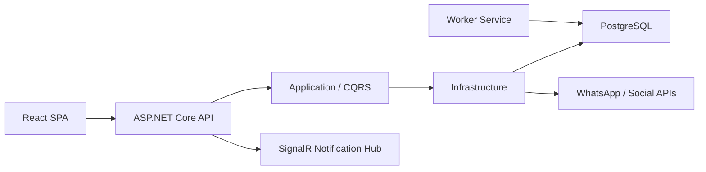

# City Communication Center Teknik Tasarım Dokümanı

Hazırlanma tarihi: 18 Haziran 2026
Kapsam: City Communication Center web uygulaması, API, veri katmanı, sosyal kanal entegrasyonları ve operasyonel akışlar.

## 1. Amaç ve Kapsam

City Communication Center; belediye içi taleplerin, vatandaş taleplerinin, sosyal medya mesajlarının ve görev atamalarının tek platformdan yönetilmesini sağlayan çok kiracılı bir iletişim ve iş akışı sistemidir.

Bu doküman şu alanları kapsar:

- Backend mimarisi ve katman sorumlulukları
- Frontend mimarisi ve sayfa/rol erişimleri
- Kimlik doğrulama, tenant çözümleme ve yetkilendirme
- Talep, görev, sosyal mesaj ve bildirim akışları
- Veri modeli ve kalıcılık yaklaşımı
- WhatsApp ve sosyal kanal entegrasyon tasarımı
- Deployment, konfigürasyon, güvenlik ve izlenebilirlik prensipleri

Bu doküman son kullanıcı kullanım kılavuzu değildir. Kullanıcı kılavuzu için `docs/user-manual.md` dosyası referans alınmalıdır.

## 2. Yüksek Seviye Mimari

Uygulama modüler monolit olarak tasarlanmıştır. Backend .NET 10 Web API üzerinde Clean Architecture ve CQRS desenlerini kullanır. Frontend React 19, TypeScript ve Vite ile geliştirilmiştir. Kalıcı veri PostgreSQL üzerinde Entity Framework Core ile yönetilir.



Ana çalışma zamanı bileşenleri:

- `frontend/`: React SPA. Aktif frontend kaynağıdır.
- `backend/src/CityCommunicationCenter.Api`: HTTP API, middleware, auth, SignalR ve controller katmanı.
- `backend/src/CityCommunicationCenter.Application`: CQRS command/query handler'ları, validasyonlar ve uygulama servis arayüzleri.
- `backend/src/CityCommunicationCenter.Domain`: Entity, enum ve domain tipleri.
- `backend/src/CityCommunicationCenter.Infrastructure`: EF Core, PostgreSQL, tenant çözümleme, LDAP, sosyal kanal istemcileri, ayar servisleri.
- `backend/src/CityCommunicationCenter.Shared`: API ile frontend arasında kullanılan ortak kontratlar.
- `backend/src/CityCommunicationCenter.Worker`: Arka plan işleme/polling servisleri.

## 3. Teknoloji Yığını

Backend:

- .NET 10
- ASP.NET Core Web API
- Entity Framework Core 10
- PostgreSQL, opsiyonel SQL Server migration altyapısı
- Mediator 3 ile CQRS
- FluentValidation pipeline davranışı
- OpenIddict 7 ile stateless password grant access token akışı
- Serilog ile loglama
- SignalR ile canlı bildirim
- ASP.NET Core Data Protection ile gizli ayarların korunması

Frontend:

- React 19
- TypeScript 5.9
- Vite 7
- React Router 7
- TanStack Query
- React Hook Form ve Zod
- SignalR client
- Vite PWA altyapısı

Operasyon:

- Docker Compose
- PostgreSQL 18 Alpine container
- API container
- Frontend Nginx/static hosting container
- Upload ve Data Protection key volume'leri

## 4. Backend Katman Tasarımı

### 4.1 API Katmanı

API katmanı HTTP sınırını yönetir. Controller'lar mümkün olduğunca ince tutulur ve iş mantığını CQRS handler'larına devreder.

Başlıca sorumluluklar:

- HTTP endpoint tanımları
- Auth ve authorization policy uygulama
- Tenant bağlamını request'e taşıma
- Global hata yakalama
- CORS, rate limiting, localization ve forwarded header yönetimi
- SignalR hub yayınlama
- OpenAPI/Scalar geliştirme dokümantasyonu

Önemli endpoint grupları:

- `AuthController`: tenant login context, token akışı, interactive auth
- `TasksController`: görev listeleme, detay, atama, tamamlama ve onay akışları
- `JobsController`: talep oluşturma, onaylama, reddetme, iptal, geri gönderme
- `SocialMessagesController`: sosyal mesaj listeleme, detay, talebe dönüştürme ve cevaplama
- `SocialSettingsController`: sosyal kanal ayarları
- `SocialWebhooksController`: WhatsApp ve sosyal webhook girişleri
- `NotificationsController`: bildirim listeleme, okunma ve okunmamış sayısı
- `DepartmentsController`, `UsersController`, `ReportsController`, `RoutingController`, `AdminController`

### 4.2 Application Katmanı

Application katmanı use-case odaklıdır. Command ve query handler'ları business akışlarını yönetir.

Temel desen:

```csharp
public record SomeCommand(...) : ICommand<ResponseType>;
public sealed class SomeCommandHandler : ICommandHandler<SomeCommand, ResponseType>
```

Sorumluluklar:

- Talep/görev/sosyal mesaj iş kuralları
- Validasyon kuralları
- DTO ve shared contract üretimi
- Tenant, kullanıcı ve rol bazlı iş kısıtları
- Bildirim üretimi
- Workflow ve SLA hesaplama servislerini çağırma

Application katmanı doğrudan altyapı detayına bağımlı değildir. Veritabanı erişimi `IApplicationDbContext`, sosyal medya servisleri ve tenant ayar servisleri gibi abstraction'lar üzerinden yapılır.

### 4.3 Domain Katmanı

Domain katmanı entity ve enum tiplerini barındırır. Domain entity'leri tenant bazlı audit alanlarıyla çalışır.

Ana entity'ler:

- `Tenant`: Belediye/kurum tenant kaydı.
- `TenantSetting`: Tenant görünüm, LDAP, auth policy, sosyal kanal, SMS, dosya saklama ve çalışma saati ayarları.
- `Department`: Müdürlük/birim.
- `ApplicationUser`: Kullanıcı, rol, departman, yönetici ve kaynak bilgisi.
- `UserDepartmentAssignment`: Kullanıcının birden fazla birimle ilişkilendirilmesi.
- `Job`: Talep ana kaydı.
- `JobDepartment`: Talebin sahip, hedef veya koordinasyon birimleri.
- `WorkTask`: Talep altındaki operasyonel görev.
- `WorkflowApproval`: Talep/görev onay kayıtları.
- `AssignmentHistory`: Görev atama geçmişi.
- `SocialMessage`: Sosyal kanal veya vatandaş mesajı.
- `CitizenConversation`: Vatandaş konuşma bağlamı.
- `SocialConversationEntry`: Konuşma mesaj girişleri.
- `WhatsAppMessageTemplate`: WhatsApp şablon kayıtları.
- `Notification`: Sistem içi bildirim.
- `NotificationReadCursor`: Okunmamış bildirim sayımı için kullanıcı okuma işaretçisi.
- `PushSubscription`: Web push aboneliği.
- `Attachment`: Dosya eki.
- `RoutingRule`: Otomatik yönlendirme kuralı.
- `AuditLog`: Denetim kaydı.

### 4.4 Infrastructure Katmanı

Infrastructure katmanı teknik uygulamaları içerir:

- PostgreSQL EF Core `CityCommunicationCenterDbContext`
- Tenant query filter uygulaması
- Data Protection ile gizli tenant ayarlarının şifrelenmesi
- LDAP authentication
- Kullanıcı auth servisleri
- WhatsApp/sosyal kanal HTTP client factory
- Routing service
- SLA hesaplama
- Syslog forwarding
- File storage ayarları
- SMS ayarları

`AddInfrastructureServices` içinde PostgreSQL bağlantısı, tenant accessor, EF interceptor'ları ve tüm altyapı servisleri DI container'a kaydedilir.

## 5. Frontend Tasarımı

Frontend tek sayfa uygulamasıdır ve build-time tenant sabitleme modelini destekler.

Ana dizinler:

- `frontend/src/app`: Route ve shell yapısı.
- `frontend/src/api`: HTTP client, auth client ve API konfigürasyonu.
- `frontend/src/context`: Auth ve tema context'leri.
- `frontend/src/pages`: Ekran bileşenleri.
- `frontend/src/components`: Ortak layout, form, tablo, rich text, bildirim ve UI bileşenleri.
- `frontend/src/hooks`: Sıralama, filtre, debounce ve SignalR hook'ları.
- `frontend/src/lib`: Rol erişimi, tenant ve yardımcı işlevler.

Önemli sayfalar:

- `/dashboard`: Kontrol paneli.
- `/requests/new`: Talep oluşturma.
- `/my-requests`: Taleplerim.
- `/incoming-requests`: Birime gelen talepler.
- `/outgoing-requests`: Birimden giden talepler.
- `/my-tasks`: Görevlerim.
- `/department-tasks`: Birimdeki görevler.
- `/staff-tasks`: Personelimin görevleri.
- `/social`: Vatandaş/sosyal mesajları.
- `/whatsapp`: WhatsApp yazışmaları.
- `/departments`: Birim yönetimi.
- `/users`: Kullanıcı yönetimi.
- `/settings`: Sistem ayarları.
- `/audit`: Denetim kayıtları.
- `/display`: Wallboard/gösterim ekranı.

Frontend rol bazlı sayfa erişimini `rolePageAccess.ts` üzerinden uygular. Sistem yöneticisi tüm yönetim alanlarına erişebilir. Müdür, operatör, personel ve rapor kullanıcıları için sayfa erişimleri tenant ayarlarıyla daraltılabilir.

## 6. Tenant Tasarımı

Sistem çok kiracılıdır. Her belediye tenant olarak modellenir. Tenant çözümleme aşağıdaki kaynaklardan yapılabilir:

1. Build-time veya frontend header ile gönderilen explicit `TenantId`
2. Host header üzerinden custom domain
3. Tek aktif tenant varsa `SingleTenant`
4. Manuel seçim akışı

Tire Belediyesi için tenant ID:

```text
b2c3d4e5-f6a7-5b6c-9d0e-1f2a3b4c5d6e
```

EF Core tarafında tenant-scoped entity'ler için query filter uygulanır. Böylece uygulama tenant bağlamı aktifken yalnızca ilgili tenant kayıtlarını görür.

## 7. Kimlik Doğrulama ve Yetkilendirme

### 7.1 Token Akışı

Canonical token endpoint:

```text
/connect/token
```

Desteklenen grant:

```text
password
```

OpenIddict degraded/stateless modda çalışır:

- Token storage kapalıdır.
- Authorization storage kapalıdır.
- Refresh token kullanılmaz.
- Access token ömrü varsayılan olarak 8 saattir.
- Tenant seçimi `tenant_id` parametresi ve token claim'leriyle taşınır.

Access token içinde beklenen claim'ler:

- `sub`
- `name`
- `displayName`
- `email`
- `role`
- `tenant_id`
- `tenantId`
- `tenant_name`

### 7.2 Login Kaynak Sırası

Giriş akışı önce yerel kullanıcı parolasını doğrular. Yerel doğrulama başarısız olursa LDAP bind denenir. LDAP ile giriş yalnızca uygulamada daha önce linklenmiş kullanıcılar için başarılı olur.

### 7.3 Adaptive Authentication

Tenant bazlı adaptive auth ayarları `TenantSetting.AuthPolicyJson` içinde saklanır.

Desteklenen yaklaşımlar:

- İç ağda otomatik oturum açma: `TrustedHeader` veya `Negotiate`
- Dış ağda interaktif ikinci faktör: `/api/v1/auth/interactive/start` ve `/api/v1/auth/interactive/verify`
- Tek kullanımlık exchange credential ile canonical password grant üzerinden token üretimi

### 7.4 Yetkilendirme

API tarafında temel policy'ler:

- Default authenticated user policy
- Tenant member policy
- Platform admin policy

Frontend tarafındaki roller:

- `SystemAdmin`
- `Manager`
- `Operator`
- `Staff`
- `Reporter`

## 8. Talep ve Görev İş Akışı

### 8.1 Talep Modeli

Talep `Job` entity'siyle temsil edilir. Her talep:

- Tenant'a bağlıdır.
- Sahip birime sahiptir.
- Bir veya daha fazla hedef/koordinasyon birimi içerebilir.
- Bir veya daha fazla `WorkTask` üretebilir.
- Manuel, sosyal mesaj veya entegrasyon kaynağından gelebilir.

Talep tipleri:

- İç birim talebi
- Dış birim talebi
- Vatandaş talebi

### 8.2 Görev Modeli

Görev `WorkTask` entity'siyle temsil edilir.

Atama modeli:

- Departman havuzu görevi: `AssignedDepartmentId` dolu, `AssignedUserId` boş.
- Kişiye atanmış görev: `AssignedDepartmentId` ve `AssignedUserId` dolu.
- Personel, kendi departman havuzundaki uygun görevi sahiplenebilir.
- Müdür ve sistem yöneticisi açık atama/yeniden atama yapabilir.

Görev yaşam döngüsü:

- Waiting / beklemede
- Assigned / atanmış
- InProgress / işlemde
- Completed / tamamlandı
- Rejected / reddedildi
- Closed / kapandı

### 8.3 Talep Ekran Grupları

Frontend talepleri farklı bağlamlarda gösterir:

- Taleplerim: Kullanıcının açtığı talepler.
- Birime Gelen Talepler: Kullanıcının birimine gelen talepler.
- Birimden Giden Talepler: Kullanıcının biriminden çıkan talepler.
- Görevlerim: Kullanıcıya veya kullanıcının birimine atanmış işler.
- Birimdeki Görevler: Müdürün birim havuzu ve birim görevleri.
- Personelimin Görevleri: Müdürün personeline atanmış görevler.

Filtreler status, tarih, son tarih, arama metni ve kolon bazlı filtreleme üzerinden çalışır.

## 9. Sosyal Kanal ve WhatsApp Tasarımı

Sosyal kanal entegrasyonları infrastructure içinde platform adaptörleriyle izole edilir. Application katmanı platform detaylarını bilmez; `ISocialMediaClient`, `ISocialMediaClientFactory` ve `ISocialMediaSettingsProvider` abstraction'ları üzerinden çalışır.

Desteklenen veya yapılandırılan kanal tipleri:

- WhatsApp
- X
- Facebook
- Instagram
- e-Devlet
- Email
- WebForm / diğer kaynaklar

### 9.1 WhatsApp Ayarları

WhatsApp entegrasyonu tenant bazlı yapılandırılır:

- Business Account ID
- Phone Number ID
- Access Token
- Meta App Secret
- Webhook Verify Token
- Callback URL
- Otomatik bilgilendirme seçeneği

Callback URL frontend ayar ekranında API origin ve tenant ID ile oluşturulur:

```text
{API_ORIGIN}/api/v1/social/webhooks/whatsapp/{tenantId}
```

Meta tarafında aynı verify token girilmelidir. Meta doğrulama sırasında API endpoint'i token'ı kontrol eder ve doğrulama challenge yanıtını döner.

### 9.2 Sosyal Mesajdan Talebe Dönüşüm

Sosyal mesaj akışı:

1. Webhook veya manuel kayıt ile `SocialMessage` oluşur.
2. Mesaj sosyal mesaj ekranında listelenir.
3. Kullanıcı mesajı talebe dönüştürür.
4. `Job` kaydı oluşturulur.
5. Kaynak referansı `SourceRefId` ile sosyal mesaja bağlanır.
6. İlgili birime görev/talep akışı başlatılır.

WhatsApp yazışmaları `CitizenConversation` ve `SocialConversationEntry` kayıtlarıyla konuşma bağlamında tutulur.

## 10. Bildirim Tasarımı

Bildirimler `Notification` entity'siyle saklanır. Kullanıcıların okunmamış sayısı `NotificationReadCursor` ile hesaplanır.

Bildirim yayın kanalları:

- API üzerinden bildirim listeleme ve okunma endpoint'leri
- SignalR hub: `/hubs/notifications`
- Web push aboneliği için `PushSubscription`

Frontend `NotificationBell` ve SignalR hook'ları üzerinden canlı bildirim alır. Bildirim detayına gidildiğinde ilgili talep/görev popup veya detay görünümü açılır.

## 11. Dosya Ekleri ve Statik İçerik

Dosya ekleri `Attachment` entity'si ile takip edilir. API upload limitini yaklaşık 6 MB multipart body olarak yapılandırır.

API çalışma dizininde `uploads` klasörü oluşturulur ve `/uploads` request path'i üzerinden statik dosya olarak servis edilir.

Docker ortamında upload verileri kalıcı volume üzerinde tutulur:

```text
city-communication-center-uploads
```

## 12. Raporlama ve Dashboard

Raporlama modülleri:

- Dashboard özetleri
- İş yükü raporları
- SLA raporları
- Sosyal trend raporları
- Yönetici/üst yönetim özetleri

Rapor sorguları application katmanında `Reports` feature'ı altında toplanır. Frontend dashboard ve rapor sayfaları bu contract'ları kullanarak grafik ve özet alanları üretir.

## 13. Yönetim ve Ayarlar

Sistem ayarları tenant bazlıdır. Ayar ekranında şu gruplar bulunur:

- Kurum/organizasyon ayarları
- Görünüm ve tema
- Rol/sayfa erişimleri
- Sosyal kanal entegrasyonları
- Yönlendirme kuralları
- Vatandaş kanalı ayarları
- Şablonlar

Gizli alanlar Data Protection ile korunur. Bu yaklaşım, veritabanında access token, app secret, LDAP şifresi, SMS bilgileri gibi hassas değerlerin düz metin saklanmasını engeller.

## 14. Veritabanı ve Migration Tasarımı

Varsayılan provider PostgreSQL'dir. Runtime bağlantı bilgisi `ConnectionStrings:CityCommunicationCenter` üzerinden alınır.

Migration setleri provider bazlı ayrılmıştır:

- `Migrations/PostgreSql`
- `Migrations/SqlServer`

Design-time context'ler:

- `PostgreSqlCityCommunicationCenterDbContext`
- `SqlServerCityCommunicationCenterDbContext`

Docker ortamında API başlangıçta migration uygulayacak şekilde yapılandırılmıştır:

```text
Database__ApplyMigrationsOnStartup=true
```

Seed verileri ilk tenant ve temel kullanıcı/birim kurulumunu sağlar. Demo seed davranışı konfigürasyonla kontrol edilmelidir.

## 15. API Çalışma Zamanı Pipeline

API başlangıç pipeline'ı özetle:

1. Localization
2. Forwarded headers
3. Migration ve ilk parola seed
4. Routing
5. CORS
6. Upload static file serving
7. Exception middleware
8. Authentication
9. Authorization
10. Rate limiting
11. Serilog request logging
12. Controller endpoint'leri
13. SignalR notification hub

Geliştirme ortamında OpenAPI JSON ve Scalar API referansı yayınlanır.

## 16. Deployment Tasarımı

Docker Compose servisleri:

- `postgres`: PostgreSQL database
- `api`: ASP.NET Core API
- `frontend`: React build çıktısını servis eden frontend container

Varsayılan lokal portlar:

- Frontend: `13000`
- API: `15000`
- PostgreSQL: `5432`

Önemli environment değişkenleri:

- `CCC_DB_PASSWORD`
- `CCC_SIGNING_KEY`
- `CCC_FRONTEND_PUBLIC_ORIGIN`
- `CCC_API_PUBLIC_ORIGIN`
- `CCC_TENANT_ID`
- `CCC_AUTH_ISSUER`
- `CCC_AUTH_AUDIENCE`
- `CCC_KNOWN_PROXY_0`

Tek tenant frontend deploy modeli:

- Her belediye için ayrı frontend build alınır.
- `VITE_TENANT_ID` build-time değişkeniyle tenant sabitlenir.
- Frontend login context çağrısında `X-Tenant-Id` header gönderir.
- Kullanıcıya belediye seçim ekranı gösterilmez.

## 17. Güvenlik Tasarımı

Ana güvenlik kararları:

- Access token üretimi OpenIddict üzerinden yapılır.
- Refresh token kullanılmaz.
- Token doğrulama OpenIddict validation pipeline ile yapılır.
- CORS production ortamında açıkça konfigüre edilmelidir.
- Rate limiting IP bazlı fixed window limiter ile uygulanır.
- Forwarded header güveni yalnızca tanımlı proxy/network ile sınırlandırılır.
- Gizli tenant ayarları Data Protection ile korunur.
- Upload dosyaları ayrı klasörde tutulur ve boyut limiti uygulanır.
- Platform admin işlemleri rol policy ile korunur.

Özellikle production ortamında şu değerler güçlü ve gizli tutulmalıdır:

- `Authentication:SigningKey`
- WhatsApp access token
- Meta app secret
- LDAP bind credentials
- SMS provider credentials
- Data Protection key volume

## 18. İzlenebilirlik ve Hata Yönetimi

Loglama Serilog ile yapılır. API request logları status code ve süreye göre farklı seviyelerde yazılır.

Hata yönetimi:

- `ExceptionMiddleware` global hata yakalar.
- Validasyon hataları FluentValidation pipeline ile üretilir.
- API hata yanıtları tutarlı problem details formatına yakın tutulur.
- Health endpoint database erişimini doğrular.

Audit:

- `AuditLog` entity'si uygulama içi önemli işlemleri takip eder.
- `AuditLogSyslogInterceptor` ile syslog forwarding desteklenir.

## 19. Build ve Doğrulama Komutları

Backend:

```bash
dotnet build backend/CityCommunicationCenter.sln
```

Frontend:

```bash
cd frontend
npm run build
npm run lint
```

Docker:

```bash
docker compose up -d
```

E2E:

```bash
cd tests/e2e
npm test
```

## 20. Bilinen Teknik Borçlar ve Takip Konuları

- Tenant çözümleme halen claim ve header kombinasyonunu destekler; auth claim tabanlı tek yol sertleştirmesi ileride ele alınmalıdır.
- Görev onaylama, atama ve kapatma işlemleri ek authorization kurallarıyla daha ayrıntılı sertleştirilebilir.
- EF CLI tooling sürümü runtime patch seviyesiyle aynı seriye sabitlenerek migration uyarıları azaltılabilir.
- Sosyal kanal entegrasyonları için production retry, dead-letter ve webhook replay stratejileri ayrıca netleştirilmelidir.
- Backend unit/integration test projeleri henüz standart hale getirilmemiştir.
- Büyük dosya ekleri ve kalıcı dosya saklama için dış object storage opsiyonu değerlendirilebilir.

## 21. Değişiklik Yaparken Dikkat Edilecek İlkeler

- Yeni endpoint eklemeden önce mevcut CQRS feature yapısı içinde genişletme tercih edilmelidir.
- Ortak API response shape'leri `CityCommunicationCenter.Shared.Contracts` altında tutulmalıdır.
- Tenant-scoped veri erişiminde query filter davranışı korunmalıdır.
- Sosyal platform detayları application katmanına taşınmamalıdır.
- Frontend tarafında yeni sayfa erişimleri `rolePageAccess.ts` ile uyumlu eklenmelidir.
- `frontend_old/` arşivdir; aktif geliştirme ve build için kullanılmamalıdır.
- Production ayarlarında CORS, signing key, Data Protection ve proxy güveni açıkça yapılandırılmalıdır.
