# Yeni Tim İletişim Merkezi Kullanıcı Kılavuzu

**Uygulama:** City Communication Center / Yeni Tim  
**Hedef kullanıcılar:** Belediye personeli, birim yöneticileri, sistem yöneticileri ve üst düzey kullanıcılar  
**Sürüm tarihi:** 08.08.2026  
**Ekran görüntüleri:** `docs/user-manual/screenshots/` — yenileme: `tests/e2e/specs/user-manual-screenshots.spec.ts` (Playwright)

**Lisans rozetleri (bu kılavuzda):**

| Rozet | Anlam |
| --- | --- |
| **Kİ** | Kurum İçi İş Takip modülü (`internal`) |
| **VT** | Vatandaş İş Takip modülü (`citizen`) |
| **⚙** | Sistem yönetimi (rol + genelde her iki modül) |
| **Rol** | Sayfa ayrıca rol / sayfa yetkisi gerektirir |

---

## 1. Uygulamanın Amacı

Yeni Tim İletişim Merkezi; belediye içi talepleri, birimler arası talepleri, vatandaş kanallarından gelen başvuruları ve görev takibini tek ekranda yönetmek için kullanılır.

Uygulamada temel işler şunlardır:

- Talep oluşturmak ve taleplerin durumunu takip etmek
- Birime gelen talepleri onaylamak, personele atamak veya iptal etmek
- Görevleri tamamlamak, yönlendirmek veya iptal etmek
- Vatandaş kanallarından gelen mesajları talebe dönüştürmek
- WhatsApp Business entegrasyonunu yönetmek
- Kullanıcı, birim, rol ve sistem ayarlarını düzenlemek
- Bildirimler üzerinden ilgili talep veya görev detayına ulaşmak

---

## 2. Lisans Modülleri: İki Uygulama Yüzü

Yeni Tim tek giriş ve tek menü altında çalışır; ancak belediye **iki ayrı lisans modülü** satın alabilir. Aktif modüller menüyü, sayfa erişimini ve bazı Anasayfa kartlarını belirler.

| Modül kodu | Kullanıcıya görünen ad | Rozet |
| --- | --- | --- |
| `internal` | Kurum İçi İş Takip Sistemi | **Kİ** |
| `citizen` | Vatandaş İş Takip Sistemi | **VT** |


### 2.1 Modüller ne zaman görünür?

- **Her iki modül aktif:** Kurum içi talep/görev akışı ve vatandaş kanalları birlikte kullanılır (rol yetkisine bağlı).
- **Yalnız VT aktif:** Reporter / Operatör ağırlıklı menü; Anasayfa-Vatandaş, WhatsApp, SMS onayı, e-Devlet vb. **VT** ekranları açılır. Kurum içi talep/görev menüleri gizlenir.
- **Yalnız Kİ aktif:** Birim içi/dışı talep, görev, rutin görev, izleme ekranı vb. **Kİ** ekranları açılır. `Birimden Giden Talepler` menüde kalır. Operatör için `Talep Oluştur` yalnızca vatandaş modülü açıksa görünür.

Lisans kodları **Ayarlar > Lisans** sekmesinden (Sistem Yöneticisi) girilir; süre ve modül durumu sunucu tarafında doğrulanır.

### 2.2 Menü — modül ve rol haritası

Aşağıdaki tablo **lisans + rol** birleşiminin tipik sonucudur; Sistem Yöneticisi **Rol Sayfa Yetkileri** ile satır bazında kısıtlayabilir.

| Menü / sayfa | Rozet | Not |
| --- | --- | --- |
| Anasayfa — Birimler (`/dashboard/birimler`) | **Kİ** | Kurum içi özet kartları |
| Anasayfa — Vatandaş (`/dashboard`) | **VT** | Vatandaş kanalı özetleri |
| Vatandaş Bilgi Listesi | **VT** | CRM tarzı vatandaş kartları |
| Talep Oluştur — Birim İçi / Birim Dışı | **Kİ** | |
| Talep Oluştur — Vatandaş Çağrı | **VT** | Operatör + VT lisansı |
| Taleplerim | **Kİ** | VT kapalıyken gizlenir |
| Birime Gelen / Birimden Giden Talepler | **Kİ** | Giden, Kİ kapalı olsa da görünebilir |
| Rutin Görev Oluştur, Görevlerim, Birimdeki Görevler | **Kİ** | |
| Vatandaş Talepleri (sosyal liste), WhatsApp | **VT** | |
| SMS Onayı, Vatandaşa Gönderilecek Mesaj Onayı | **VT** | |
| e-Devlet Günlük Faaliyet Planı / Listesi | **VT** | |
| Kurum İçi Mesajlar (alt FAB) | **Kİ** | Personel içi anlık mesaj |
| İzleme ekranı (wallboard) | **Kİ** | Yeni sekmede |
| Birimler, Kullanıcılar, Ayarlar, Denetim | **⚙** | Rol + genelde tam lisans |

### 2.3 Ekran görüntüleri ve ortam

Bu kılavuzdaki görseller **canlı Tire kurulumundan** (`yenitim.tire.bel.tr`) Playwright ile alınmıştır; `operator` rolüyle çekilen ekranlar yönetim sayfalarını kapsamayabilir. Yönetim ekran görüntüleri Sistem Yöneticisi erişimiyle üretilmiş veya metinle tamamlanmıştır. **Tamamla / İptal / Onay** gibi duruma bağlı popup’lar, listede uygun kayıt yoksa otomatik üretilmez; `tests/e2e/specs/user-manual-screenshots.spec.ts` ile yeniden çalıştırılabilir.

---

## 3. Roller ve Yetkiler

Uygulamada görünen menüler kullanıcının rolüne ve sistem yöneticisi tarafından verilen sayfa yetkilerine göre değişebilir.

### 3.1 Sistem Yöneticisi

Sistem yöneticisi genel yönetim ekranlarına erişebilir.

Başlıca yetkiler:

- Anasayfa
- Talep Oluştur
- Taleplerim
- Vatandaş Talepleri
- Birime Gelen Talepler
- Rutin Görev Oluştur
- Görevlerim
- İzleme ekranı
- Birimler
- Kullanıcılar
- Ayarlar
- Denetim kayıtları

Sistem yöneticisi ayrıca Ayarlar bölümünden rol-sayfa erişimlerini düzenleyebilir.

### 3.2 Birim Yöneticisi / Sorumlu

Birim yöneticisi kendi birimiyle ilgili talepleri ve görevleri yönetir.

Başlıca yetkiler:

- Talep oluşturma
- Kendi taleplerini takip etme
- Birime gelen talepleri onaylama veya iptal etme
- Birimden giden talepleri takip etme
- Birimde oluşan görevleri takip etme
- Personel görevlerini izleme
- Görev yönlendirme ve personel atama
- Rutin görev oluşturma

### 3.3 Personel

Personel çoğunlukla kendisine atanan görevler ve kendi oluşturduğu talepler üzerinden çalışır.

Başlıca yetkiler:

- Talep oluşturma
- Taleplerim ekranından kendi taleplerini takip etme
- Görevlerim ekranından kendisine atanan görevleri takip etme
- Görevi tamamlama veya yetkisi dahilinde iptal/iade işlemleri

### 3.4 Üst Düzey Kullanıcı

Üst düzey kullanıcı talep oluşturabilir ve kendi taleplerini takip edebilir. Bu kullanıcıdan gelen talepler ve bu taleplerden oluşan görevler bazı listelerde dikkat rengiyle öne çıkar.

### 3.5 Operatör

Operatör rolü çoğunlukla vatandaş kanallarından gelen kayıtları izlemek ve talebe dönüştürmek için kullanılır.

Başlıca yetkiler:

- Vatandaş Talepleri ekranını kullanma
- WhatsApp yazışmalarını görüntüleme ve yanıtlama
- Vatandaş talebi oluşturma ve mevcut mesajdan talebe dönüştürme
- Talep oluşturma (birim içi ve birim dışı dahil)

Onay kuralları (Operatör için):

- **Vatandaş talebi:** Birim yöneticisi onayı gerekmez; talep oluşturulduğunda doğrudan işleme alınır. Başkanlık veya daire başkanlığı seviyesindeki birimlere vatandaş talebi yönlendirilemez.
- **Birim içi / birim dışı talep:** Personel gibi birim yöneticisi onayı gerektirir; onay tamamlanana kadar son tarih atanmaz ve gridde **Onay Bekleyen** görünür.

---

## 4. Giriş ve Genel Ekran Kullanımı

### 4.1 Giriş Yapma

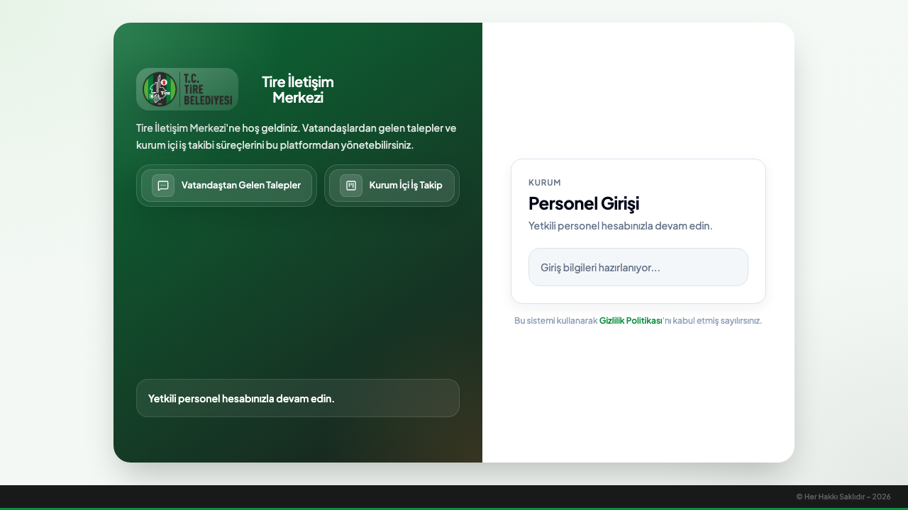

1. Uygulama adresine gidin.
2. Kullanıcı adınızı ve şifrenizi girin.
3. Giriş yaptıktan sonra rolünüze ve aktif lisans modüllerine göre **Anasayfa** veya varsayılan sayfa açılır.

Kurum içi otomatik giriş veya ikinci doğrulama gibi ek güvenlik adımları kurum ayarlarına göre değişebilir.

### 4.2 Üst Menü

Üst bölümde şunlar bulunur:

- Genel arama alanı
- Bildirim zili
- Yardım/kılavuz kısayolu
- Kullanıcı bilgisi
- Çıkış butonu

Bildirim ziline tıklayarak okunmamış bildirimleri görebilir, ilgili talep veya görev detayına geçebilirsiniz.

### 4.3 Sol Menü

Sol menüden ana modüllere erişilir. Menüde gördüğünüz seçenekler rolünüze göre değişebilir.

Yaygın menüler:

- Anasayfa
- Talep Oluştur
- Taleplerim
- Vatandaş Talepleri
- Birime Gelen Talepler
- Birimden Giden Talepler
- Rutin Görev Oluştur
- Görevlerim
- Birimdeki Görevler
- Personelimin Görevleri
- İzleme ekranı
- Birimler
- Kullanıcılar
- Ayarlar

### 4.4 Kurum İçi Mesajlar (alt FAB) — **Kİ**

Ekranın alt köşesindeki **Kurum İçi Mesajlar** düğmesi personel arası anlık yazışma panelini açar (**VT** modülünden bağımsız; **Kİ** lisansı ve rol yetkisi gerekir).


- Personel listesinden karşı seçilir; mesaj yazılır, isteğe bağlı **Dosya ekle** ile ek gönderilir.
- Karşı tarafta **Yazıyor** göstergesi (SignalR) görünebilir.
- WhatsApp veya vatandaş kanallarından **farklı** bir iletişim yüzeyidir.

---

## 5. Anasayfa

Anasayfa, kullanıcının rolüne ve **aktif lisans modüllerine** göre iki yüz sunar:

| Yüz | Rozet | Yol |
| --- | --- | --- |
| Anasayfa — Birimler | **Kİ** | `/dashboard/birimler` |
| Anasayfa — Vatandaş | **VT** | `/dashboard` |

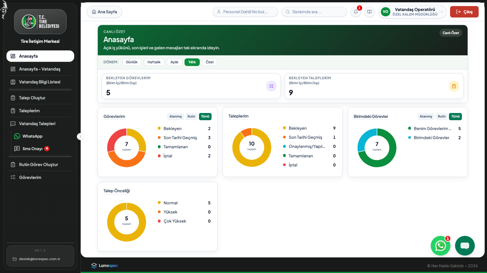

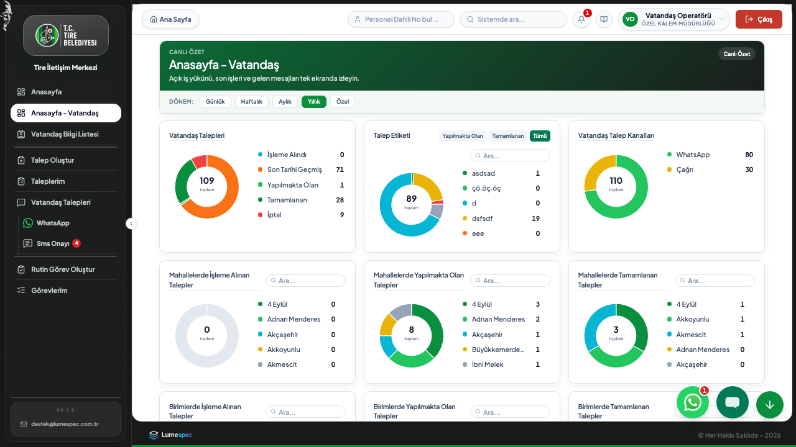

**Kİ** yüzünde örnek kartlar: bekleyen görevlerim, bekleyen taleplerim, birimdeki görevler, talep önceliği dağılımı.

**VT** yüzünde örnek kartlar: vatandaş kanallarından gelen özetler, bekleyen vatandaş işleri.

Kurum İçi modülü kapalıyken **Bekleyen Taleplerim** kutucuğu ve ilgili pie grafikleri gizlenebilir; **VT** açıkken Reporter menüsünde yalnız vatandaş odaklı Anasayfa görünür.

Kartlara tıklayarak ilgili liste ekranına geçebilirsiniz.

### 5.1 Vatandaş Bilgi Listesi — **VT**


**Vatandaş Bilgi Listesi** (`/citizen-directory`), vatandaş kartlarını arama ve filtreleme ile yönetmek için kullanılır. Telefon, ad ve diğer kimlik alanlarıyla kayıt bulunabilir; yeni vatandaş kartı oluşturulabilir ve mevcut kart detayı açılabilir. Bu ekran **VT** lisans modülüne bağlıdır.

---

## 6. Talep Oluşturma — **Kİ** / **VT**

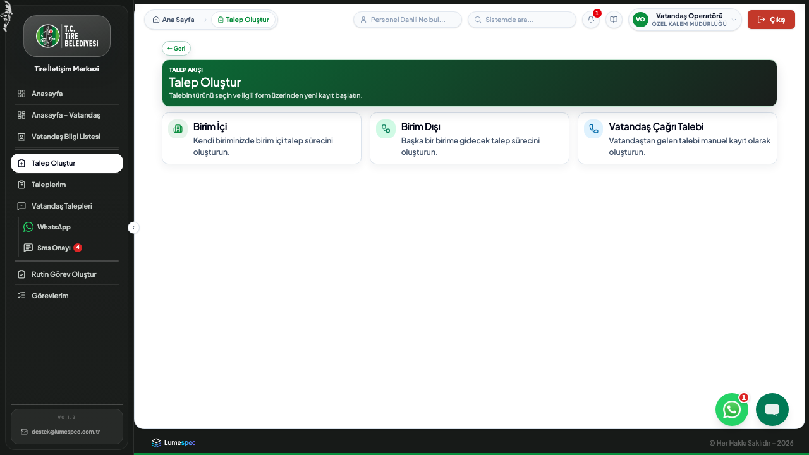

Talep oluşturmak için sol menüden **Talep Oluştur** ekranına girilir (`/requests/new`).

Talep tipleri:

- Birim İçi
- Birim Dışı
- Vatandaş Talebi

Kullanıcının rolüne göre bazı talep tipleri görünmeyebilir.

### 6.1 Birim İçi Talep Oluşturma — **Kİ**

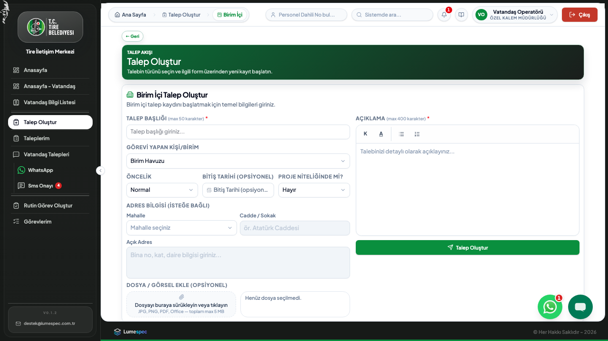

Birim içi talep, kendi biriminiz içinde iş başlatmak için kullanılır.

Adımlar:

1. **Talep Oluştur** ekranına girin.
2. **Birim İçi** seçeneğini seçin.
3. Talep başlığını yazın.
4. Öncelik seçin.
5. Bitiş tarihi gerekiyorsa seçin.
6. Talep proje niteliğindeyse **Proje niteliğinde mi?** alanını **Evet** yapın.
7. Görev sahibi kişi veya birim havuzu seçimini yapın.
8. Gerekirse adres bilgilerini girin.
9. Açıklama alanını doldurun.
10. Varsa dosya/fotoğraf ekleyin.
11. **Talep Oluştur** butonuna basın.

Yönetici rolündeki kullanıcılar birden fazla personel seçebilir. Bu durumda seçilen her personel için görev oluşturulur.

### 6.2 Birim Dışı Talep Oluşturma — **Kİ**

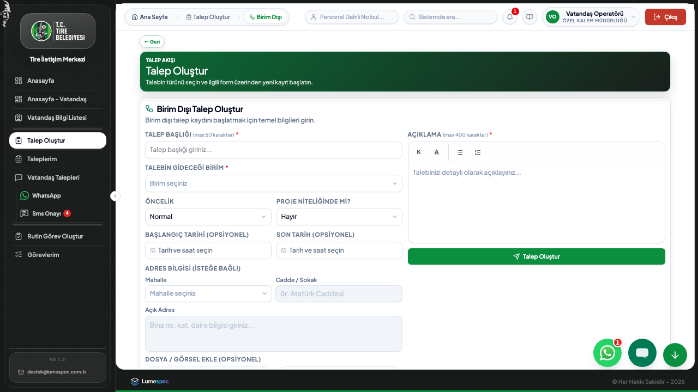

Birim dışı talep, başka bir birime gidecek talepler için kullanılır.

Adımlar:

1. **Talep Oluştur** ekranına girin.
2. **Birim Dışı** seçeneğini seçin.
3. Talep başlığını yazın.
4. Talebin gideceği birimi seçin.
5. Koordineli talep ise **Koordineli talep mi?** alanını **Evet** yapın ve ek birimleri seçin.
6. Öncelik, başlangıç ve son tarih bilgilerini girin.
7. Gerekirse adres bilgilerini girin.
8. Açıklamayı yazın.
9. Varsa dosya/fotoğraf ekleyin.
10. **Talep Oluştur** butonuna basın.

Birim dışı talep, sahip birimin onayı tamamlandıktan sonra hedef birimin gelen talep havuzuna düşer. Yönetici tarafından açılan taleplerde bu onay doğrudan tamamlanabilir; diğer kullanıcılarda yönetici onayı gerekebilir. Hedef birim yöneticisi talebi ilgili personele atar; atama sonrasında görev, seçilen personelin **Görevlerim** ekranında görünür.

### 6.3 Vatandaş Talebi Oluşturma — **VT**

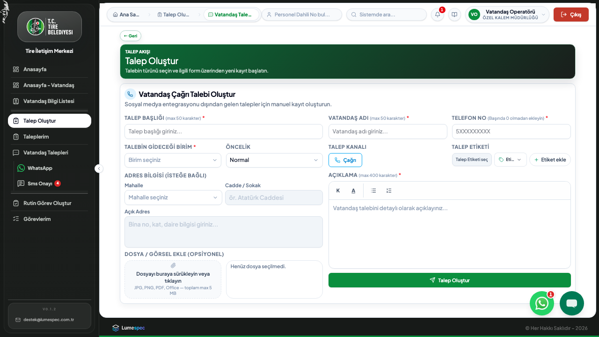

Vatandaş talebi, sosyal medya entegrasyonu dışında manuel gelen başvurular için kullanılır.

Adımlar:

1. **Talep Oluştur** ekranında **Vatandaş Talepleri** seçeneğini seçin.
2. Kanal seçin: Facebook, Instagram, X, E-posta, Web Formu, WhatsApp veya Diğer.
3. Vatandaş/gönderen bilgisini girin.
4. Kategori girin.
5. Varsa konum bilgisini girin veya mevcut konumu kullanın.
6. Talep içeriğini yazın.
7. **Talep Oluştur** butonuna basın.

---

## 7. Taleplerim — **Kİ**

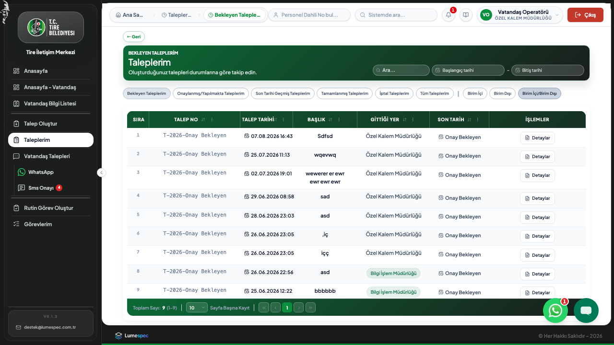

**Taleplerim** ekranı, kullanıcının oluşturduğu veya rolüne göre sorumlu olduğu talepleri gösterir (**Kİ** modülü).

Görünümler:

- Bekleyen Taleplerim
- Birim Dışı Onay Bekleyen Talepler
- Onaylanmış Taleplerim
- Yapılmakta Olan Taleplerim
- Geciken Taleplerim
- Tamamlanmış Taleplerim
- İptal Taleplerim
- Tüm Taleplerim

Listede arama ve tarih filtresi kullanılabilir. Kolon başlıklarındaki filtreleme seçenekleriyle liste daraltılabilir.

### 7.1 Talep Detayını Açma

Bir talebin **Detaylar** butonuna basıldığında pop-up açılır.

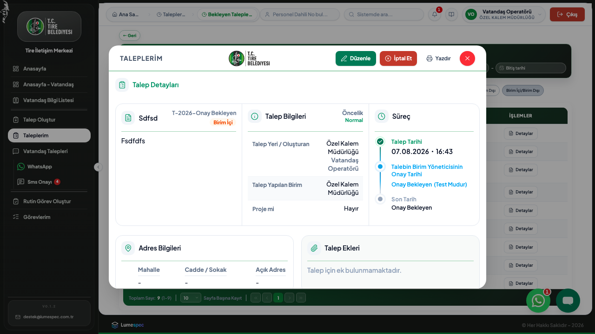

**Düzenle** modunda ek alanı ve adres alanları aktifleşir:

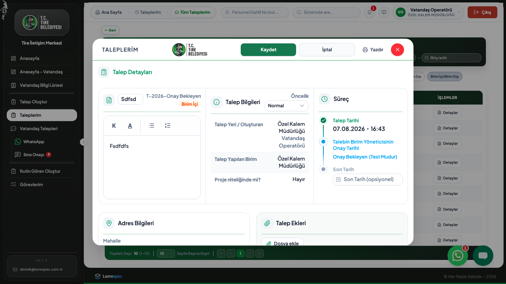

Detay ekranında görülebilecek bilgiler:

- Talep No
- Talep Başlığı
- Talep Yeri / Oluşturan
- Talebin Gittiği Birim
- Proje bilgisi
- Öncelik
- Durum
- Talep tarihi
- Talebin Birim Yöneticisinin Onay Tarihi
- Talebi Gerçekleştiren Birim Yöneticisinin Onay Tarihi
- Son tarih
- Açıklama
- Adres Bilgileri
- Yönetici Notu
- Ekler / Fotoğraflar
- Görevler
- Müdürlük onay bilgileri

Onay tarihi henüz oluşmamışsa alan **Onay Bekleyen** olarak görünür. İptal veya tamamlanma notu varsa, durum satırındaki parantezli not bağlantısına tıklayarak notu ayrı bir pencerede görebilirsiniz. İptal notu penceresinin **Kapat** düğmesi kırmızı, tamamlama notu penceresinin **Kapat** düğmesi yeşildir.

### 7.2 Talebi Yazdırma

Detay pop-up içinde **Yazdır** butonu vardır.

Yazdırma çıktısında şunlar yer alır:

- Talep Detayları
- Açıklama
- Adres Bilgileri
- Yönetici Notu
- Ekler / Fotoğraflar
- Müdürlükler
- Görevler

### 7.3 Ek / Fotoğraf Kuralları

Talep durumuna göre ek ekleme yetkisi değişir.

- Onay bekleyen uygun taleplerde ek/fotoğraf eklenebilir.
- Onaylanmış, tamamlanmış veya iptal edilmiş taleplerde ek/fotoğraf eklenemez.
- Ek yoksa ek alanında “Talep için ek/fotoğraf bulunmamaktadır.” mesajı gösterilir.

---

## 8. Birime Gelen Talepler — **Kİ**


**Birime Gelen Talepler**, biriminize gelen iç ve dış talepleri tek listede gösterir (`/incoming-requests`).

Görünümler:

- Onay Bekleyen Talepler
- Geciken Talepler
- Onaylanmış Talepler
- Tamamlanmış Talepler
- İptal Talepler
- Tümü

Ek olarak talebin kaynağına göre birim içi, birim dışı veya tüm kayıtlar filtrelenebilir.

### 8.1 Onaylama

Yetkiniz varsa ilgili satırdaki **Onayla** butonuna basarak talebi onaylayabilirsiniz. Onay popup’ında son tarih ve atama alanları görünebilir (canlı veri yoksa ekran görüntüsü üretilemeyebilir).

Birim dışı taleplerde talep, hedef birimin yöneticisi için atamaya hazır hale gelir. Yönetici personel seçtiğinde görev üretilir.

### 8.2 Personel Atama

Talep birime düştüğünde yönetici/sorumlu personel seçerek görevi atayabilir.

Atama sırasında:

- Bir veya birden fazla personel seçilebilir.
- Uygunsa kullanıcı listesinde kendi talebini oluşturan kişi işaretlenebilir.
- Atama tamamlandığında ilgili personelin Görevlerim listesine görev düşer.

### 8.3 İptal / İade

Yetki ve talep durumuna göre **İptal Et** butonu aktif olabilir. İşlem sırasında açıklama girilmesi istenir.

### 8.4 WhatsApp Konuşmasını Görüntüleme

Vatandaş talebi WhatsApp’tan geldiyse, talep ve görev detayından vatandaş ile yapılan **WhatsApp konuşması görüntülenebilir**. Bu görünüm birim yöneticisi ve görevin atandığı personel için **salt-okunurdur**; vatandaşa yanıtı yalnızca vatandaş talep operatörü yazabilir.

---

## 9. Birimden Giden Talepler — **Kİ**


**Birimden Giden Talepler**, biriminizin başka birime gönderdiği talepleri takip etmek için kullanılır.

Görünümler:

- Bekleyen Talepler
- Geciken Talepler
- Onaylanmış Talepler
- Yapılmakta Olan Talepler
- Tamamlanmış Talepler
- İptal Talepler
- Tümü

Bu ekranda talebin hedef birimde hangi aşamada olduğu izlenebilir.

Yönetici notu eklenebilen durumlarda detay pop-up içinde **Yönetici Notu** alanı düzenlenebilir.

---

## 10. Görevlerim — **Kİ**


**Görevlerim**, kullanıcıya atanmış görevleri gösterir.

Görünümler:

- Bekleyen Görevlerim
- Geciken Görevlerim
- Tamamlanmış Görevlerim
- İptal Görevlerim
- Tüm Görevlerim

### 10.1 Görev Detayı

**Detaylar** butonuna basıldığında görev pop-up’ı açılır.

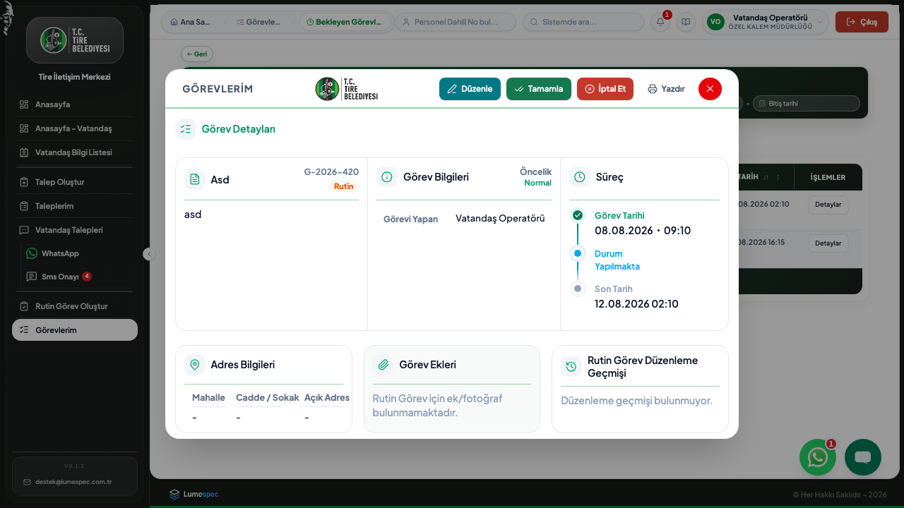

**Düzenle** modunda ek alanı ve adres güncellemeleri açılabilir:

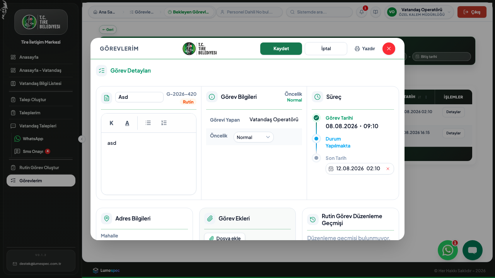

Detayda görülebilecek alanlar:

- Görev No
- Bağlı olduğu Talep No
- Görev başlığı
- Görev sahibi
- Görev tipi
- Öncelik
- Görev tarihi
- Son tarih
- Açıklama
- İlgili talep detayları
- Yönetici notu
- Ekler / Fotoğraflar
- Atama geçmişi

Görev tamamlanmış veya iptal edilmişse durum satırındaki **(Tamamlama Notu)** ya da **(İptal Notu)** bağlantısından ilgili not açılabilir. Tamamlama notu penceresindeki **Kapat** düğmesi yeşil gösterilir.

Rutin görevlerde ilgili talep bulunmadığı için talep detayları ve talep ekleri gösterilmez.

### 10.2 Görevi Tamamlama

Uygun durumdaki görevlerde **Tamamla** butonu görünür. Butona basıldığında **Görevi Tamamla** onay penceresi açılır; tamamlama notu yazılır ve isteğe bağlı ek/fotoğraf eklenir. **Dosya ekle** sırasında yükleme ilerlemesi progress bar ile gösterilir.

Tamamlama sırasında:

- Tamamlama notu yazılabilir.
- Görev ekleri/fotoğrafları eklenebilir.
- İşlem sonrası görev tamamlandı durumuna geçer veya kurum akışına göre kapanış onayı bekleyebilir.

### 10.3 Görevi İptal Etme veya Yönlendirme

Yetkiye ve görevin durumuna göre:

- Görev iptal edilebilir (**Görevi İptal Et** → iptal gerekçesi ve isteğe bağlı ek alanı olan onay penceresi).
- Görev aynı birim içindeki başka personele yönlendirilebilir.

Yönlendirme alanında personel seçimi yapılır ve **Yönlendir** butonu kullanılır.

### 10.4 Görev Durumunu Değiştirme

**Tamamlanmış Görevlerim** ve **İptal Görevlerim** görünümlerinde, ilgili satırın **İşlemler** sütununda **Detaylar** butonunun solunda **Durum Değiştir** butonu yer alır.

Butona basıldığında **Görev Durum Değişikliği** pop-up’ı açılır:

- Durum değişikliği için bir **neden** girilir.
- **Talep Durumu Seç** listesinden yeni durum seçilir: **Yapılmakta**, **Tamamlanmış** veya **İptal** (görevin mevcut durumu listede çıkmaz).
- **Durum Değiştir** ile onaylanır.

Görev **Yapılmakta** durumuna alındığında, bağlı talep tamamlanmış/iptal durumundaysa yeniden aktif (işleme alınmış) duruma döner. Bu işlemi görevin atandığı kullanıcı veya sistem yöneticisi yapabilir.

### 10.5 Görev Yazdırma

Detay pop-up içindeki **Yazdır** butonu görev çıktısı alır.

Çıktıda:

- Görev Detayları
- Açıklama
- Varsa İlgili Talep Detayları

yer alır.

---

## 11. Birimdeki Görevler — **Kİ**


**Birimdeki Görevler**, yöneticilerin kendi birimlerinde oluşan görevleri izlemesi için kullanılır.

Filtreler:

- Birim İçi Oluşan Görevler
- Birim Dışı Oluşan Görevler
- Birimde Oluşan Tüm Görevler

Durum görünümleri:

- Bekleyen Görevler
- Geciken Görevler
- Tamamlanmış Görevler
- İptal Görevler
- Tüm Görevler

Yönetici uygun görevlerde iptal, yönlendirme veya detay izleme işlemi yapabilir.

---

## 12. Personelimin Görevleri

**Personelimin Görevleri**, yöneticinin bağlı personel üzerindeki görevleri izlemesini sağlar.

Bu ekranda:

- Tüm personel veya belirli personel seçilebilir.
- Rutin görevler ve atanmış görevler ayrıştırılabilir.
- Görev durumu, son tarih ve tamamlanma bilgileri izlenebilir.

---

## 13. Rutin Görev Oluşturma — **Kİ**


**Rutin Görev Oluştur**, talebe bağlı olmayan görevler için kullanılır.

Rutin görev örnekleri:

- Periyodik bakım
- Günlük kontrol
- Düzenli saha görevi

Rutin görevler talep numarasına bağlı değildir. Bu nedenle görev detayında “Rutin görev Talep No olmaz” bilgisi gösterilebilir.

---

## 14. Vatandaş Kanalları — **VT**

Bu bölümdeki ekranlar **Vatandaş İş Takip** (`citizen`) lisans modülüne bağlıdır. Kurum yalnızca **Kİ** modülünü satın almışsa menüde görünmezler.

### 14.1 Vatandaş Talepleri (sosyal liste)


**Vatandaş Talepleri** ekranında (`/social`) sosyal medya, çağrı, e-posta veya web formu gibi kanallardan gelen kayıtlar izlenir.

Listede görülebilecek bilgiler:

- Kanal
- Telefon
- Vatandaş İsmi / Gönderen
- Kategori
- Sahip müdürlük
- Konum
- Vatandaş Talep Tarihi
- Son Tarih
- İşlemler

**Son Tarih** sütunu, kayıt henüz talebe dönüşmemişse **Vatandaş Talep Tarihi + kurum SLA süresi** ile hesaplanır. Talebe dönüştürüldükten sonra talebin kendi son tarihi kullanılır. Son tarih yoksa hücre **Onay Bekleyen** gösterir; son 24 saat içinde dolacaksa sarı, geçmişse kırmızı renkte vurgulanır (bkz. [18.6 Son Tarih ve SLA](#186-son-tarih-ve-sla)).

Bir vatandaş mesajı henüz talebe dönüşmemişse **Talep Oluştur** butonu görünür; bu işlemle mesajdan talep kaydı başlatılır.

### 14.2 WhatsApp Konuşmalar


**WhatsApp Konuşmalar** (`/whatsapp`) ekranında vatandaşlarla WhatsApp Business üzerinden yapılan yazışmalar listelenir.

- Geçmiş konuşmalar izlenir.
- Aktif 24 saatlik pencere varsa cevap yazılabilir.
- Pencere kapalıysa uygun WhatsApp taslak mesajları kullanılabilir.

Vatandaş talebi veya görev detayından açılan WhatsApp görünümü **salt okunurdur** (birim yöneticisi ve atanan personel); vatandaşa yanıt yalnızca operatör yetkisiyle WhatsApp ekranından yazılır.

### 14.3 SMS Onayı


**SMS Onayı** (`/sms-delivery-approval`), vatandaşa gönderilecek SMS metinlerinin onay sürecini yönetir. Onay bekleyen kayıtlar listelenir; yetkili kullanıcı onaylar veya reddeder.

### 14.4 Vatandaşa Gönderilecek Mesaj Onayı


**Vatandaşa Gönderilecek Mesaj Onayı** (`/citizen-message-approval`), WhatsApp veya diğer kanallardan vatandaşa iletilecek mesajların içerik onayını yönetir.

### 14.5 e-Devlet Günlük Faaliyet Planları — **VT**


e-Devlet entegrasyonu kapsamında günlük faaliyet planı oluşturma (`/edevlet/activity-plan`) ve mevcut planların listesi (`/edevlet/activity-plans`) bu modül altındadır. Rol: **EDevletActivityPlan** veya Sistem Yöneticisi.

### 14.6 WhatsApp Entegrasyonu (Sistem Yöneticisi)

Sistem yöneticisi **Ayarlar > Sosyal Entegrasyonlar > WhatsApp** bölümünden WhatsApp Business bilgilerini tanımlar.

Gerekli alanlar kurum yapılandırmasına göre şunlardır:

- Business Account ID
- Phone Number ID
- Access Token
- Meta App Secret
- Webhook Verify Token
- Meta callback URL

Meta callback URL alanı uygulama tarafından gösterilir. Bu URL Meta Developer Console’da WhatsApp webhook yapılandırmasına girilir. URL internetten HTTPS üzerinden erişilebilir olmalıdır.

---

## 15. Bildirimler

Üst menüdeki bildirim zili okunmamış bildirimleri gösterir.


Bildirimlerden:

- Talep detayına gidilebilir.
- Görev detayına gidilebilir.
- Okunmamış bildirim sayısı takip edilebilir.

Detay açıldığında pop-up üzerinden işlem yapılabilir ve kapatma butonuyla listeye dönülür.

---

## 16. İzleme Ekranı — **Kİ**


**İzleme ekranı** (`/display`), büyük ekran veya operasyon panosu için kullanılır.

Bu ekran yeni sekmede açılabilir ve genel talep/görev durumlarını takip etmek için kullanılır.

---

## 17. Yönetim Ekranları — **⚙**

### 17.1 Birimler


**Birimler** ekranında kurum içindeki müdürlük/birim kayıtları yönetilir.

Yapılabilecek işlemler:

- Birim oluşturma
- Birim düzenleme
- Birim yöneticisi atama
- Birim silme

### 17.2 Kullanıcılar


**Kullanıcılar** ekranında kullanıcı kayıtları yönetilir.

Yapılabilecek işlemler:

- Kullanıcı oluşturma
- Kullanıcı bilgilerini düzenleme
- Rol ve birim ilişkilerini ayarlama
- Kullanıcı aktiflik durumunu yönetme

### 17.3 Ayarlar


**Ayarlar** ekranı yalnızca Sistem Yöneticisi rolü için açıktır.

Sekmeler:

- Kurum bilgileri (SLA, hafta sonu kuralları, tenant kimlik politikası)
- **Lisans** — aktif modül kodları ve süre (bkz. [§2 Lisans Modülleri](#2-lisans-modülleri-iki-uygulama-yüzü))
- Görünüm
- Rol sayfa yetkileri
- Sosyal entegrasyonlar (WhatsApp, Facebook, Instagram, X, e-posta)
- Yönlendirme kuralları
- Vatandaş talebi ayarları
- Taslak mesajlar
- Kimlik doğrulama politikası (ağ içi otomatik giriş, dış ağ ikinci faktör)

### 17.4 Rol Sayfa Yetkileri


Bu bölümde her rolün hangi sayfaları görebileceği düzenlenir.

Notlar:

- Anasayfa herkes için açık kalır.
- Sistem Ayarları yalnızca Sistem Yöneticisi rolüne açıktır.
- Yetki değişikliği sonrası kullanıcıların menüsü değişebilir.
- Lisans modülü kapalı sayfalar listede görünse bile menüde çıkmayabilir.

### 17.5 Denetim Kayıtları


**Denetim kayıtları**, sistemde yapılan önemli işlemlerin izlenmesi için kullanılır.

Kullanım amaçları:

- Kim hangi işlemi yaptı?
- İşlem ne zaman yapıldı?
- Hangi kayıt üzerinde işlem yapıldı?

---

## 18. Liste ve Grid Kullanımı

Uygulamadaki listelerde ortak kullanım kuralları vardır.

### 18.1 Arama

Üstteki arama alanına kelime girerek listeyi daraltabilirsiniz.

### 18.2 Tarih Aralığı

Başlangıç ve bitiş tarihi seçerek sadece ilgili tarih aralığındaki kayıtları görebilirsiniz.

### 18.3 Kolon Filtreleri

Kolon başlıklarındaki filtre simgeleriyle belirli kolonda arama yapılabilir.

### 18.4 Sıralama

Kolon başlıklarına tıklayarak sıralama yapılabilir.

### 18.5 Sayfalama

Listenin altında sayfa boyutu ve sayfa geçiş kontrolleri bulunur.

### 18.6 Son Tarih ve SLA

**Son Tarih**, bir talep veya görevin ne zamana kadar tamamlanması beklendiğini gösterir. Çoğu ekranda takvim simgeli bir etiket (pill) olarak görünür.

#### Varsayılan SLA süresi

Her belediye (tenant) için sistem yöneticisi **Ayarlar** ekranında **Varsayılan SLA (saat)** değerini tanımlar. Kurulumda tipik değer **48 saattir** (2 iş günü). Bu süre, kullanıcı formda elle son tarih girmediğinde otomatik hesaplamada kullanılır.

#### Temel formül

```
Son Tarih = Başlangıç tarihi + SLA süresi (saat)
```

Başlangıç tarihi ekrana göre değişir:

| Ekran / kayıt türü | Başlangıç tarihi |
| --- | --- |
| Talepler (Talep Tarihi) | Talebin oluşturulma veya onaylanma anı |
| Görevler (Görev Tarihi) | Görevin oluşturulma veya atama anı |
| Vatandaş Talepleri (henüz talebe dönüşmemiş) | Vatandaş Talep Tarihi (`ReceivedAt`) |
| Rutin görev | Görev oluşturma anı |

Formda **Son Tarih** alanına elle bir değer girilirse sistem bu değeri kullanır; SLA otomatik hesabı devreye girmez.

#### Hafta sonu hariç tutma

Sistem yöneticisi **SLA hafta sonu ayarları** ile cumartesi ve pazar günlerinin SLA süresine sayılmamasını açabilir. Bu durumda saatler yalnızca hafta içi günlerde ilerler. Belirli birimler bu kuraldan muaf tutulabilir.

#### Ne zaman son tarih atanır?

- **Yönetici veya Operatör (vatandaş talebi):** Talep oluşturulur oluşturulmaz SLA uygulanır.
- **Personel veya Operatör (birim içi/dışı):** Birim yöneticisi onaylayana kadar son tarih **atanmaz**; gridde **Onay Bekleyen** görünür. Onay sonrası SLA hesaplanır.
- **Görev atama:** Havuzdan veya müdür tarafından personele atandığında, görevde son tarih yoksa SLA uygulanır.

#### Gridde renk ve metin anlamları

| Görünüm | Anlam |
| --- | --- |
| **Onay Bekleyen** | Son tarih henüz yok (çoğunlukla onay bekleniyor) |
| Normal (gri/beyaz) | Son tarih var; süre dolmamış |
| Sarı | Son tarihe 24 saatten az kaldı |
| Kırmızı | Son tarih geçti; kayıt henüz tamamlanmadı |

Tamamlanan kayıtlarda renk, tamamlanma anına göre değerlendirilir (geç tamamlandıysa kırmızı kalabilir).

#### Örnek

Varsayılan SLA **48 saat**, hafta sonu hariç değil:

- Vatandaş mesajı **10 Haziran 2026, 09:00**'da geldi → Son Tarih **12 Haziran 2026, 09:00**
- Personel birim dışı talep açtı, yönetici **11 Haziran 14:00**'te onayladı → Son Tarih **13 Haziran 14:00**

---

## 19. Durumlar ve Anlamları

### 19.1 Talep Durumları

- **Bekleyen:** Talep henüz ilgili onay/işlem adımındadır.
- **Onaylanmış:** Talep onaylanmış ve işleme hazırdır.
- **Yapılmakta:** Talep üzerinde görev/işlem devam etmektedir.
- **Geciken:** Talebin son tarihi geçmiş ancak kapanmamıştır.
- **Tamamlanmış:** Talep tamamlanmıştır.
- **İptal / Reddedildi:** Talep iptal edilmiş veya reddedilmiştir.
- **İade Edildi:** Talep revizyon veya geri dönüş için iade edilmiştir.

### 19.2 Görev Durumları

- **Bekleyen:** Görev kullanıcı veya birim havuzundadır.
- **Atanmış:** Görev bir kullanıcıya atanmıştır.
- **Yapılmakta:** Görev üzerinde çalışma devam etmektedir.
- **Geciken:** Görevin son tarihi geçmiştir.
- **Tamamlanmış:** Görev tamamlanmıştır.
- **İptal:** Görev iptal edilmiştir.

---

## 20. Sık Kullanılan İş Akışları

### 20.1 Birim Dışı Talep Akışı

1. Kullanıcı **Talep Oluştur > Birim Dışı** ekranından talep oluşturur.
2. Sahip birimin onayı tamamlanır.
3. Talep hedef birimin **Birime Gelen Talepler** havuzuna düşer.
4. Hedef birim yöneticisi personele görev atar.
5. Personel görevi tamamlar.
6. Talep tamamlanır veya kapanış onayı sürecine girer.

### 20.2 Birim İçi Talep Akışı

1. Kullanıcı **Talep Oluştur > Birim İçi** ekranından talep oluşturur.
2. Görev birim havuzuna veya seçilen personele düşer.
3. Personel görevi tamamlar.
4. Talep/görev sonucu detay ekranından takip edilir.

### 20.3 Vatandaş Mesajından Talep Akışı

1. Vatandaş mesajı Vatandaş Talepleri ekranına düşer.
2. Kullanıcı mesajı inceler.
3. **Talep Oluştur** butonuyla kayıt açılır.
4. Talep ilgili birime yönlendirilir.
5. Birim talebi işleme alır ve görev atar.

---

## 21. Sorun Giderme

### 21.1 Menüde Beklediğim Sayfayı Göremiyorum

Olası nedenler:

- Rolünüzün o sayfaya erişimi yoktur.
- Sistem yöneticisi rol-sayfa yetkisini kapatmıştır.
- **Lisans modülü** (Kİ / VT) kapalıdır; menüde görünmez.
- Yanlış kullanıcı/birimle giriş yapılmıştır.

Çözüm:

- Kullanıcı rolünüzü kontrol edin.
- Sistem yöneticisinden sayfa yetkinizi kontrol etmesini isteyin.

### 21.2 Talebe Ek Ekleyemiyorum

Talep onaylandıysa, tamamlandıysa veya iptal edildiyse sonradan ek/fotoğraf eklenemez.

### 21.3 Görev Tamamla Butonu Pasif

Görev size atanmadıysa veya görev uygun durumda değilse tamamlama butonu pasif olabilir.

### 21.4 WhatsApp Webhook Doğrulanmıyor

Kontrol edilmesi gerekenler:

- Meta callback URL doğru mu?
- Verify token aynı mı?
- URL internetten HTTPS ile erişilebilir mi?
- DNS ve SSL ayarları doğru mu?
- Meta tarafında `messages` alanına abone olundu mu?

### 21.5 Bildirim Sayısı Görünmüyor

Sayfayı yenileyin. Hâlâ görünmüyorsa kullanıcı oturumu, bildirim yetkisi veya arka plan bildirim bağlantısı kontrol edilmelidir.

---

## 22. İyi Kullanım Önerileri

- Talep başlığını kısa ve anlaşılır yazın.
- Açıklama alanında yapılacak işi net tarif edin.
- Son tarih ve öncelik bilgisini doğru seçin.
- Dosya/fotoğraf eklerini talep onaylanmadan önce ekleyin.
- Görev yönlendirmelerinde doğru personeli seçtiğinizden emin olun.
- Tamamlama notunu ileride anlaşılacak şekilde yazın.
- Vatandaş taleplerinde kanal, gönderen ve kategori bilgisini mümkün olduğunca doğru girin.

---

## 23. Kısa Terimler

- **Talep:** Birim içi, birim dışı veya vatandaş kaynaklı iş kaydı.
- **Görev:** Talep kapsamında veya rutin olarak personele verilen iş.
- **Birim Havuzu:** Henüz kişiye atanmamış, birimin sahip olduğu görev/talep havuzu.
- **Koordineli Talep:** Birden fazla birimin dahil olduğu talep.
- **Yönetici Notu:** Talep detayında yöneticinin eklediği açıklama.
- **Ekler / Fotoğraflar:** Talep veya görevle ilgili yüklenen dosya ve görseller.
- **Geciken:** Son tarihi geçmiş fakat tamamlanmamış kayıt.
- **SLA (Service Level Agreement):** Kurumun tanımladığı hedef yanıt/tamamlama süresi; uygulamada saat cinsinden **Varsayılan SLA** ayarıyla temsil edilir.
- **Son Tarih:** SLA veya kullanıcı girişine göre hesaplanan bitiş zamanı; gridlerde takvim etiketiyle gösterilir.
- **Onay Bekleyen (Son Tarih):** Son tarih henüz atanmadığında grid hücresinde görünen metin; onay sürecindeki taleplerde yaygındır.

---

## 24. Rol, Kapsam ve İşlem Sınırları

Bu tablo, erişimin genel çalışma kuralını açıklar. Kuruma özel rol-sayfa ayarları bu erişimleri daraltabilir; bir menünün görünmesi tek başına her işlem için yetki olduğu anlamına gelmez.

| İşlem | Personel | Birim yöneticisi | Sistem yöneticisi |
| --- | --- | --- | --- |
| Kendi talebini oluşturma ve izleme | Evet | Evet | Evet |
| Birim havuzundaki işi sahiplenme | Uygun görevlerde | Evet | Evet |
| Birime gelen talebi kabul/ret | Hayır | Kendi biriminde | Tüm yetkili kapsamda |
| Personele görev atama veya yeniden atama | Hayır | Kendi biriminde | Evet |
| Görevi tamamlama | Kendine atanmış görevde | Yetkili görevde | Yetkili görevde |
| Birim, kullanıcı ve sistem ayarı yönetimi | Hayır | Kurum ayarına bağlı | Evet |
| Denetim kayıtlarını inceleme | Hayır | Yetkiye bağlı | Evet |

Bir kullanıcı birden fazla birime bağlıysa, işlem ekranlarında seçili birim bağlamını kontrol edin. Yanlış birim bağlamı, beklenen talep veya görevlerin listede görünmemesine neden olabilir.

## 25. Talep Yaşam Döngüsü ve Karar Noktaları

Talep durumu yalnızca renk değil, yapılabilecek sonraki işlemi de belirler.

| Sistem durumu | Kullanıcıdaki karşılığı | Sonraki olağan işlem |
| --- | --- | --- |
| Taslak | Henüz gönderilmemiş | Bilgileri tamamlayıp oluşturma/gönderme |
| Sahip birim onayı bekliyor | Yönetici onayı bekleyen | Sahip birim yöneticisinin onayı veya reddi |
| Dış birim onayı bekliyor | Hedef birim bekliyor | Hedef birim yöneticisinin kabulü, reddi veya ataması |
| Aktif | Yapılmakta | Görev atama, ilerletme ve tamamlama |
| Revizyon istendi | İade edildi | Açıklamayı güncelleyip tekrar değerlendirmeye sunma |
| Tamamlandı | Tamamlandı | Sonuç ve notların kontrolü |
| Reddedildi / İptal | İşlem sonlandırıldı | Gerekirse yeni talep açma |

Bir birim dışı talepte sahip birim kararı ile hedef birimin kararı farklı zamanlarda oluşabilir. Bu nedenle detay ekranındaki iki onay tarihi, aynı olayın tekrarı değildir. Hedef birim henüz işlem yapmadıysa tarih alanında **Onay Bekleyen** görünür.

## 26. Görev Yaşam Döngüsü ve Kapatma Süreci

Görevler talep altında oluşabilir veya rutin görev olarak bağımsız başlatılabilir.

1. **Bekleyen:** Görev birim havuzunda veya işleme alınmayı bekleyen durumdadır.
2. **Atanmış:** Bir personele atanmıştır; görev sahibinin listesinde görünür.
3. **Yapılmakta:** Çalışma sürmektedir. Varsa ilerleme notu ve güncel son tarih girilmelidir.
4. **Kapanış onayı bekliyor:** Kurumun iş akışı kapanış kontrolü gerektiriyorsa görev tamamlamadan sonra bu aşamaya geçebilir.
5. **Tamamlandı:** İş sonucu kaydedilmiş, görev sonlandırılmıştır.
6. **Revizyon istendi / reddedildi / iptal:** Açıklama veya gerekçe detay ekranındaki durum notundan incelenir.

Görev tamamlanırken yazılan not, işin nasıl sonuçlandığını anlatmalıdır. İptal, revizyon ve ret işlemlerinde gerekçe yazılması; denetim, sonraki atama ve vatandaş bilgilendirmesi için önemlidir.

## 27. Detay Ekranı Davranışları

Talep ve görev detayları listeyi terk etmeden açılır. İşlem yaptıktan sonra liste verisi güncellenir; yine de uzun süre açık bırakılmış ekranlarda güncel sonuç için yenileme yapılması önerilir.

- Durum satırındaki parantezli not, sadece işlem gerekçesini gösterir; kayıt verisini değiştirmez.
- Ek indirme bağlantısı yeni sekmede veya tarayıcının indirme davranışına göre açılabilir.
- Görev sahibi boşsa kayıt birim havuzundadır; bu, görevin kaybolduğu anlamına gelmez.
- Son tarih boşsa kayıt için zorunlu teslim tarihi tanımlanmamıştır. Son tarih geçmiş uyarısı yalnızca tanımlı tarihler için oluşur.
- Tamamlama veya iptal sonrasında izin verilen işlemler durum ve role göre azalır; bu normal bir iş akışı kısıtıdır.

## 28. Bildirim ve Canlı Güncellemeler

Bildirimler atama, onay, iade, tamamlanma ve benzeri önemli iş akışı değişiklikleri için üretilir. Açık oturumlarda bildirim zili canlı güncellenebilir.

Bildirim beklenenden geç görünürse:

1. İnternet bağlantısını ve oturumun açık olduğunu kontrol edin.
2. Sayfayı yenileyin; özellikle uzun süre açık kalan tarayıcı sekmelerinde bu faydalıdır.
3. İlgili talebi **Birime Gelen Talepler**, **Taleplerim** veya **Görevlerim** ekranındaki uygun görünümden arayın.
4. Sorun sürerse talep numarası, işlem zamanı ve kullanıcı/birim bilgisiyle sistem yöneticisine başvurun.

## 29. Destek Kaydı İçin Gerekli Bilgiler

Bir iş akışı sorunu bildirirken aşağıdaki bilgiler çözüm süresini kısaltır:

- Talep veya görev numarası
- İşlemin yapıldığı tarih ve yaklaşık saat
- İşlemi yapan kullanıcı ve işlem yapılan hedef birim
- Ekrandaki durum ve görülen hata metni
- Sorunu tekrar üretmek için izlenen adımlar
- Varsa ekran görüntüsü; kişisel veri veya erişim anahtarı içermemelidir

## 30. Ekran ve Liste Alanları Referansı

Her liste, kullanıcı rolüne, seçili görünüme ve kayıt durumuna göre bazı kolonları gizleyebilir. Aşağıdaki katalog, ekranda beklenebilecek temel alanları belirtir.

| Ekran | Ana kolonlar | Duruma bağlı kolon/işlem |
| --- | --- | --- |
| Anasayfa — Birimler / Vatandaş | Özet kartlar, grafikler | **Kİ** / **VT** modülüne göre yüz |
| Vatandaş Bilgi Listesi | Ad, telefon, kimlik alanları | Kart oluşturma, detay |
| Taleplerim / Birimden Gidenler | Talep No, Talep Tarihi, Oluşturan, Başlık, Görev Sahibi, Gittiği Yer, Son Tarih | Onay, tamamlama veya iptal tarihi; durum; detay |
| Birime Gelen Talepler | Talep No, Talep Tarihi, Talep Yeri/Oluşturan, Başlık, Görev Sahibi, Son Tarih | Onay/tamamlama/iptal tarihi; durum; kabul, ret, atama, detay |
| Görevlerim / Birimdeki Görevler | Bağlı Talep No, Görev No, Görev Tarihi, Talep Yeri/Oluşturan, Başlık, Görev Sahibi, Görev Tipi, Son Tarih | Tamamlanma veya iptal tarihi; durum; sahiplenme, atama, ilerletme, detay |
| Personelimin Görevleri | Görev ve talep tanımı, atanan kişi, son tarih, durum | Yeniden atama, son tarih güncelleme, detay |
| Vatandaş Talepleri (sosyal) | Kanal, Telefon, Vatandaş İsmi, kategori, sahip müdürlük, konum, Vatandaş Talep Tarihi, Son Tarih | Yazışma, kategorileme, yönlendirme, talebe dönüştürme |
| WhatsApp Konuşmalar | Konuşma listesi, son mesaj, durum | Yanıt, taslak mesaj |
| SMS Onayı / Mesaj Onayı | Gönderilecek metin, kanal, durum | Onay, ret |
| e-Devlet faaliyet planları | Plan tarihi, birim, durum | Oluşturma, listeleme |
| Denetim Kayıtları | Tarih, işlem, kullanıcı, not | Arama ve kayıt bağlamını inceleme |
| Ayarlar (Lisans) | Modül kodu, süre, durum | **Kİ** / **VT** aktivasyonu |

Tüm uygun listelerde arama, tarih aralığı, kolon filtresi, sıralama ve sayfalama kullanılır. Bir filtre sonucu boşsa önce görünümü (ör. tamamlanmış/iptal/tümü), sonra tarih aralığını ve seçili birimi kontrol edin.

## 31. Form Alanları ve Veri Kalitesi

Talep veya görev formundaki başlık, açıklama, hedef birim, görev sahibi, öncelik ve tarih alanları iş akışının farklı aşamalarını etkiler.

- **Başlık:** Listelerde ayırt edici kısa tanımdır; genel ifadelerden kaçının.
- **Açıklama:** Yapılacak iş, konum, beklenen sonuç ve varsa vatandaş bağlamını içermelidir.
- **Öncelik:** İş sıralaması için kullanılır; teknik olarak son tarih yerine geçmez.
- **Başlangıç/son tarih:** Zaman planlama ve gecikme görünümünü etkiler. Son tarih boş bırakılırsa onay sonrası veya otomatik onaylı oluşturmada kurum SLA süresi uygulanır (bkz. [18.6](#186-son-tarih-ve-sla)). Elle girilen son tarih SLA hesabının yerine geçer.
- **Hedef birim ve koordinasyon birimleri:** Dış talebin nereye düştüğünü belirler; oluşturduktan sonra yönlendirme kararlarının detaydan izlenmesi gerekir.
- **Görev sahibi:** Boş bırakılırsa iş birim havuzunda kalabilir. Bir kişiye atama, o kişinin görev listesine düşmesini sağlar.
- **Adres, konum ve ek:** Saha işleri için doğrulanabilir konum ve açıklayıcı ek kullanılmalıdır.

Zorunlu alanlar talep/görev türüne ve kurum ayarına göre değişebilir. Form gönderilmediğinde ekranda görünen doğrulama mesajını düzeltmeden ilerlenemez.

## 32. Örnek Kabul Senaryoları

Kullanıcılar, sistem değişikliğinden sonra bu senaryolarla temel davranışı kontrol edebilir:

1. Personel birim dışı talep açar; sahip yönetici onaylar; kayıt hedef birim yöneticisinin gelen havuzunda görünür.
2. Hedef yönetici personel atar; görev sadece ilgili kullanıcının görev listesinde görünür ve görev sahibi kolonu doğru adı gösterir.
3. Personel tamamlanma notu yazar; görev/talep durumu güncellenir ve detaydan not okunabilir.
4. Yetkisiz kullanıcı, başka birimin gelen talebini onaylayamaz veya görevini atayamaz.
5. Sosyal mesaj talebe dönüştürüldüğünde kaynak mesaj ve yeni talep arasındaki bağ detaydan izlenebilir.
6. Aynı kullanıcıda yeni bildirim oluştuğunda zil sayısı güncellenir; bildirim açıldığında doğru kayda gidilir.

Bu senaryolardan birinde beklenmeyen sonuç varsa, kayıt numarası ve işlem zamanıyla destek kaydı oluşturun.
