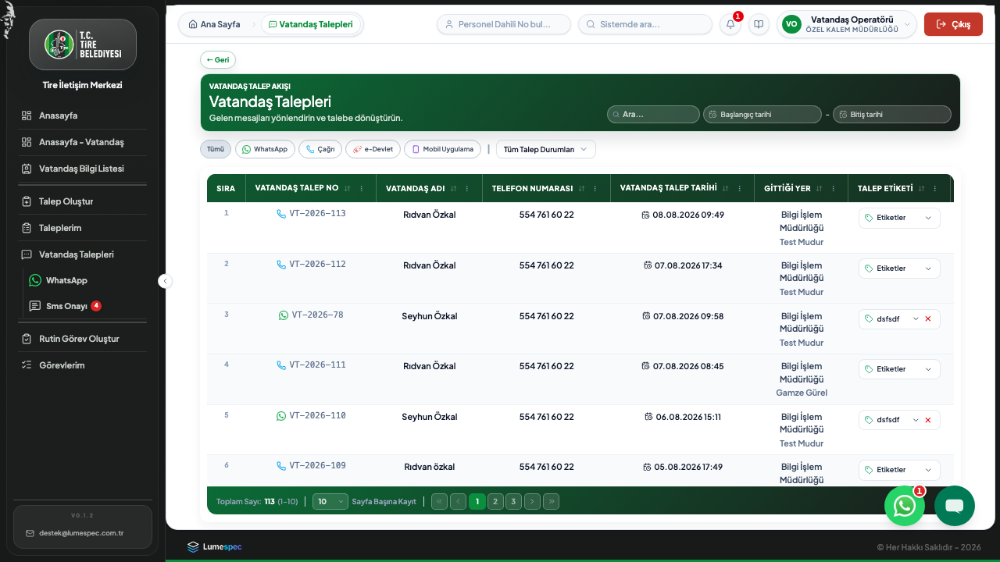
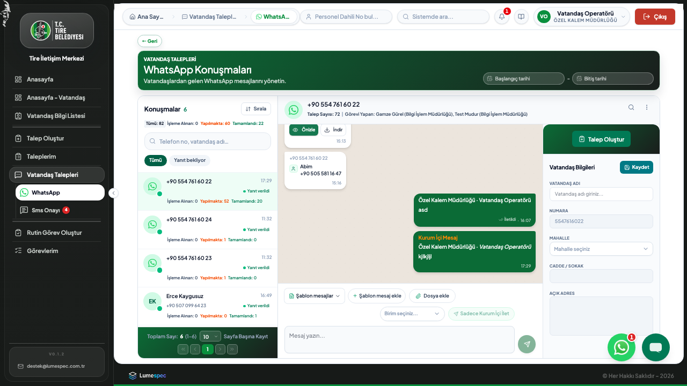
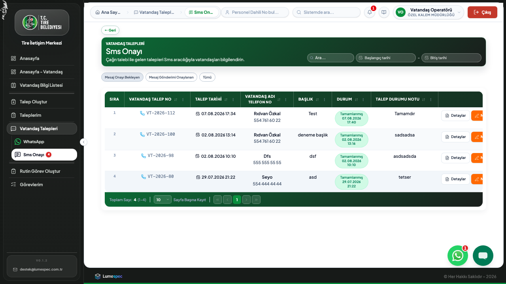
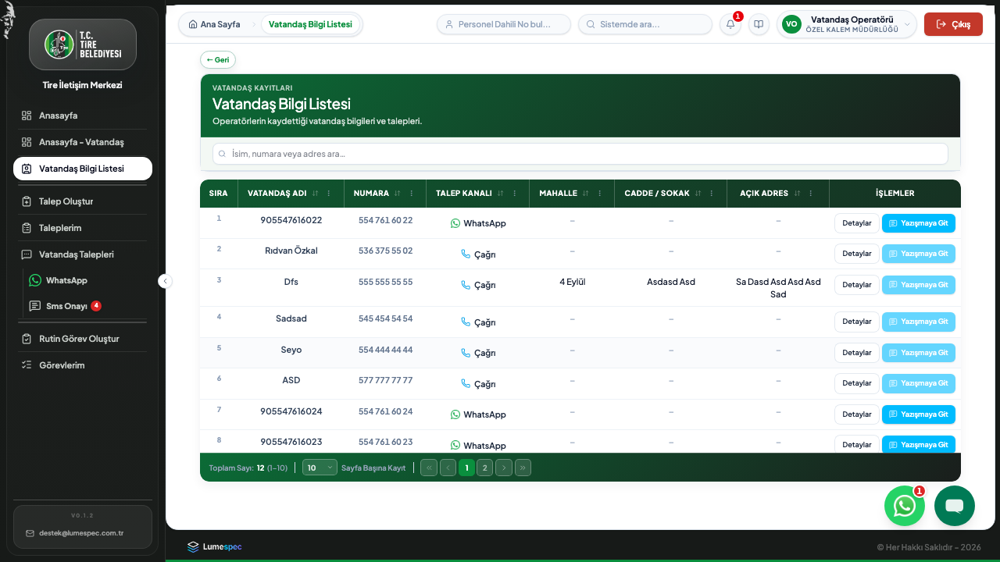
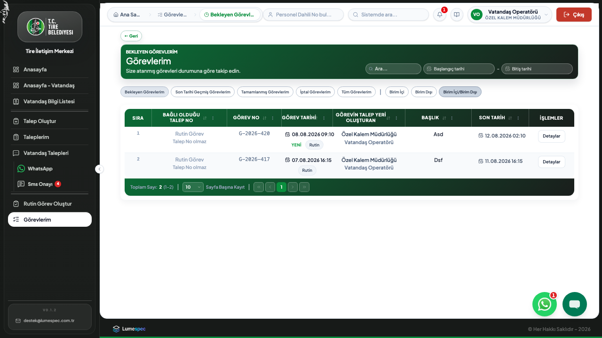
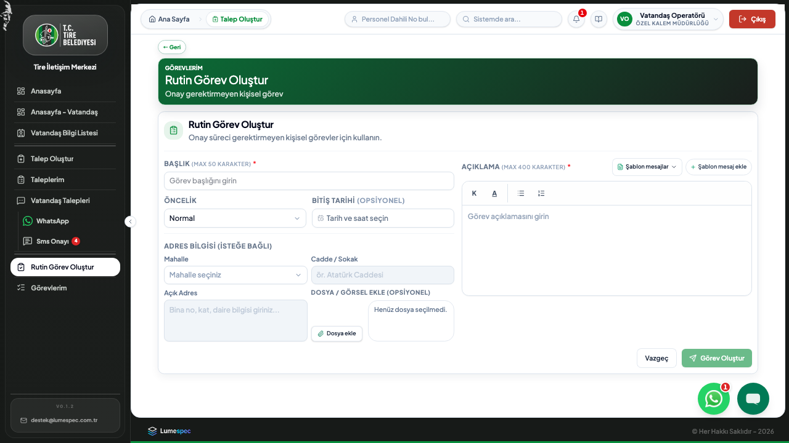
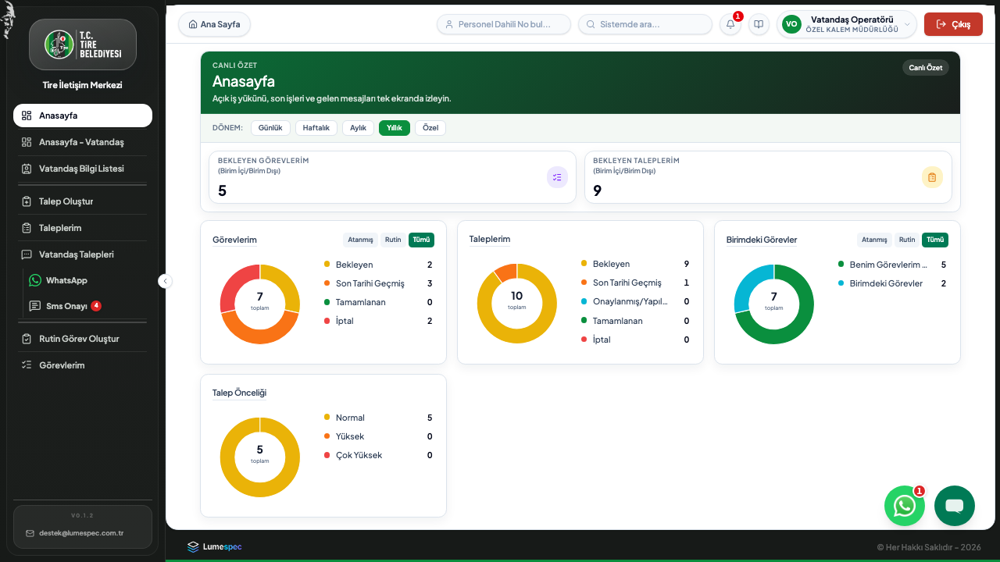
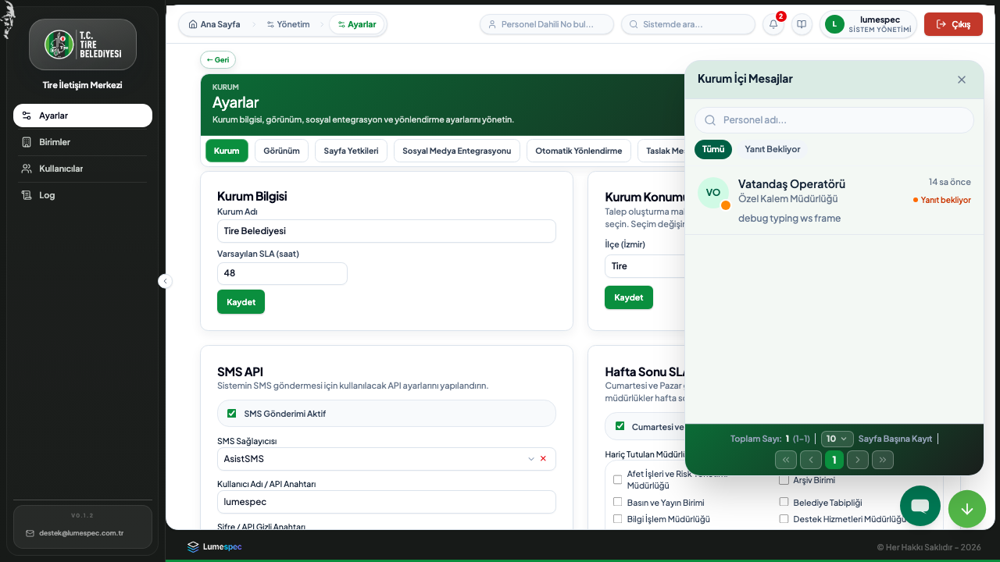
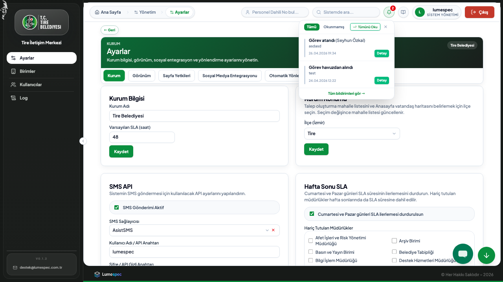

# Yeni Tim İletişim Merkezi

**Belediyeler için modüler dijital iletişim ve iş takip platformu**

---

## Yeni Tim nedir?

Yeni Tim, belediyelerin hem **vatandaşla iletişimini** hem de **kurum içi iş akışını** tek bir platformda, tek girişle yönetmesini sağlayan bir yazılımdır.

Uygulama, birbirinden bağımsız olarak lisanslanabilen **iki ayrı ürün** üzerine kurulur:

| Modül | Ne yapar | Rozet |
| --- | --- | --- |
| **Vatandaş İş Takip Sistemi** | Sosyal medya, WhatsApp, SMS, e-Devlet ve web formu üzerinden gelen vatandaş taleplerini tek noktada toplar, takip eder ve yanıtlar | **VT** |
| **Kurum İçi İş Takip Sistemi** | Birim içi ve birimler arası talepleri, görev atamalarını, onay süreçlerini ve rutin işleri yönetir | **Kİ** |

Belediye ihtiyacına göre yalnızca birini veya her ikisini birden satın alabilir. Hangi modüllerin aktif olduğu, menüyü ve ekran erişimlerini otomatik olarak şekillendirir — kullanıcı, ihtiyacı olmayan bir ekranla karşılaşmaz.

---

## Neden iki ayrı ürün?

Belediyelerde vatandaş talebi yönetimi ile kurum içi iş takibi, farklı ekiplerin, farklı süreçlerin ve çoğu zaman farklı bütçe kalemlerinin konusudur:

- Halkla ilişkiler / iletişim birimi çoğunlukla yalnızca **vatandaş kanalı** yönetimiyle ilgilenir.
- Fen İşleri, Temizlik İşleri gibi saha birimleri ise öncelikle **kendi iç iş akışını** dijitalleştirmek ister.

Yeni Tim bu ihtiyacı tek bir monolitik pakete zorlamak yerine, **modüler lisanslama** ile çözer: küçük bir belediye yalnızca Kurum İçi modülüyle başlayabilir, büyüyen ihtiyaçla birlikte Vatandaş modülünü sonradan ekleyebilir — ya da tam tersi.

---

## Ürün 1 — Vatandaş İş Takip Sistemi (VT)

Vatandaşın belediyeyle kurduğu her temas noktasını tek ekranda toplar.

### TEK NOKTADAN ÇOKLU KANAL

Facebook, Instagram, X, E-posta, Web Formu, WhatsApp ve telefon üzerinden gelen tüm başvurular aynı listede, aynı kurallarla işlenir.

### WHATSAPP BUSINESS ENTEGRASYONU

Vatandaşla yapılan WhatsApp yazışmaları uygulama içinden yürütülür; konuşma geçmişi talep ve görev kaydına bağlı kalır.

### VATANDAŞA GİDEN HER MESAJ ONAYDAN GEÇER

SMS ve WhatsApp üzerinden vatandaşa gönderilecek metinler, gönderilmeden önce yetkili onayından geçirilir — kurumsal dil ve doğruluk garanti altına alınır.

### VATANDAŞ KARTI VE GEÇMİŞ

Her vatandaş, telefon/kimlik bilgisiyle eşleşen bir karta sahiptir; geçmiş başvurular ve iletişim bilgileri aranabilir, filtrelenebilir.

### E-DEVLET ENTEGRASYONU

Günlük faaliyet planları e-Devlet'e uygun formatta oluşturulur ve takip edilir.

### OTOMATİK SLA TAKİBİ

Her vatandaş talebi, kurumun tanımladığı hedef yanıt süresine (SLA) göre otomatik olarak izlenir; süresi dolmak üzere olan veya geçmiş kayıtlar renkle vurgulanır — hiçbir başvuru gözden kaçmaz.

---

## Ürün 2 — Kurum İçi İş Takip Sistemi (Kİ)

Belediye birimlerinin kendi aralarındaki iş akışını, kağıt ve dağınık yazışma yerine tek dijital süreçte yönetir.

### BİRİM İÇİ VE BİRİMLER ARASI TALEP

Bir birim kendi içinde iş başlatabilir ya da işi başka bir birime yönlendirebilir; birimler arası talepler otomatik onay ve atama akışından geçer.

### GÖREV ATAMA VE TAKİP

Onaylanan talepler görevlere dönüşür, personele atanır ve tamamlanana kadar izlenir.

### RUTİN GÖREVLER

Belirli bir talebe bağlı olmayan periyodik bakım, günlük kontrol gibi tekrarlayan işler de sisteme dahil edilir.

### İZLEME EKRANI (WALLBOARD)

Operasyon odalarında büyük ekranda gösterilebilecek, kurumun genel talep ve görev durumunu özetleyen canlı bir görünüm.

### KURUM İÇİ ANLIK MESAJLAŞMA

Personel, vatandaş kanallarından bağımsız, kurum içi hızlı yazışma için dahili bir mesajlaşma panelinden faydalanır.

---

## Her iki modülde ortak: yönetim ve güvenlik altyapısı

Modül seçimi ne olursa olsun, aşağıdaki altyapı her kurulumda hazır gelir.

### ROL BAZLI YETKİLENDİRME

Sistem yöneticisi, birim yöneticisi, personel, operatör ve üst düzey kullanıcı rolleri; her rolün hangi sayfayı göreceği satır satır özelleştirilebilir.

### BİRİM VE KULLANICI YÖNETİMİ

Kurum organizasyon yapısı — müdürlükler, birim yöneticileri, personel atamaları — uygulama üzerinden yönetilir.

### DENETİM KAYITLARI

Kim, ne zaman, hangi kayıt üzerinde işlem yaptı — tüm kritik işlemler denetim izine düşer.

### KURUMSAL AYARLAR

SLA süreleri, hafta sonu kuralları, kimlik doğrulama politikası ve sosyal medya entegrasyon anahtarları tek bir ayarlar ekranından yönetilir.

### BİLDİRİMLER

Kullanıcılar, kendilerini ilgilendiren talep ve görev güncellemelerinden anlık olarak haberdar olur.

---

## Neden Yeni Tim

- **Modüler lisanslama** — yalnızca ihtiyaç duyduğunuz ürünü satın alırsınız, sonradan genişletebilirsiniz.
- **Çoklu belediye (multi-tenant) mimari** — her kurumun verisi izole tutulur; aynı altyapı birden fazla belediyeye tek merkezden hizmet verebilir.
- **Modern teknoloji altyapısı** — güncel, ölçeklenebilir bir teknoloji yığını üzerine inşa edilmiştir; büyüyen veri ve kullanıcı sayısına uyum sağlar.
- **Türkçe süreç ve dil** — arayüz, onay metinleri ve hata mesajları uçtan uca Türkçe ve belediye iş akışına özel tasarlanmıştır.
- **Kanıtlanmış kullanım** — Tire Belediyesi'nde canlı olarak, günlük operasyonda kullanılmaktadır.

---

## Lisanslama modeli

| Paket | İçerik | Kimin için uygun |
| --- | --- | --- |
| Yalnız Kİ | Kurum İçi İş Takip Sistemi | Vatandaş kanalı yönetimini henüz merkezileştirmemiş, önce iç süreçlerini dijitalleştirmek isteyen belediyeler |
| Yalnız VT | Vatandaş İş Takip Sistemi | Kurum içi süreci başka bir sistemle yürüten, öncelikle vatandaş iletişimini tek noktaya toplamak isteyen belediyeler |
| Kİ + VT | Her iki modül birlikte | Uçtan uca dijital dönüşüm hedefleyen belediyeler |

Lisans kodları ve süresi, Sistem Yöneticisi tarafından **Ayarlar > Lisans** ekranından girilir; doğrulama sunucu tarafında yapılır.

---

## Sonraki adım

Kurumunuza en uygun modül kombinasyonunu belirlemek ve canlı bir demo görmek için bizimle iletişime geçin.
