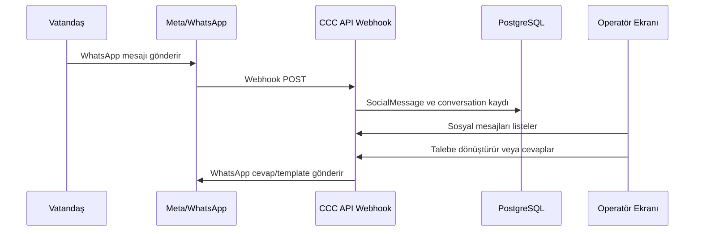

# WhatsApp ve Sosyal Medya Entegrasyon Rehberi

Hazırlanma tarihi: 18 Haziran 2026

Bu doküman WhatsApp Business ve diğer sosyal kanalların City Communication Center'a bağlanması için gerekli teknik ve operasyonel adımları açıklar.

## 1. Genel Mimari

Sosyal kanal entegrasyonları tenant bazlıdır. Her belediye kendi kanal credential'larını Ayarlar ekranından tanımlar.



## 2. WhatsApp için Gerekli Bilgiler

Uygulamada WhatsApp kanalını aktif etmek için:

- Meta App
- WhatsApp Business Account
- Business Account ID
- Phone Number ID
- Permanent Access Token
- Meta App Secret
- Webhook Verify Token
- Callback URL

## 3. Meta App Oluşturma

Meta Developers üzerinde:

1. Yeni app oluşturun veya mevcut app'i seçin.
2. Use case olarak WhatsApp/Business Messaging ekleyin.
3. WhatsApp product alanından API setup'a gidin.
4. WhatsApp Business Account bağlayın.
5. Telefon numarasını ekleyin veya mevcut numarayı bağlayın.

## 4. WhatsApp Business Account

WhatsApp Business Account Meta Business Manager içinde bulunur. Uygulamadaki `Business Account ID` alanına bu WABA ID yazılır.

Phone Number ID ise WhatsApp API setup veya phone numbers bölümünde ilgili numaranın teknik ID'sidir. Telefon numarasının kendisi değildir.

## 5. Permanent Access Token

Production için kısa süreli test token yerine sistem kullanıcısı üzerinden kalıcı token üretilmelidir.

Önerilen akış:

1. Meta Business Settings'e gidin.
2. System Users bölümünden system user oluşturun.
3. İlgili app ve WhatsApp Business Account için yetki verin.
4. Token oluşturun.
5. WhatsApp Business Management ve WhatsApp Business Messaging izinlerini ekleyin.
6. Token'ı uygulamadaki Access Token alanına girin.

Token gizlidir. Ekran görüntüsü, e-posta veya açık dokümana yazılmamalıdır.

## 6. Meta App Secret

Meta Developers içinde:

1. App'i açın.
2. App Settings > Basic ekranına gidin.
3. App Secret alanını görüntüleyin.
4. Uygulamadaki Meta App Secret alanına girin.

App Secret webhook imza doğrulama ve provider güvenliği için kullanılır.

## 7. Webhook Verify Token

Verify token Meta'dan alınmaz. Ekip tarafından belirlenen rastgele, tahmin edilmesi zor bir değerdir.

Kurallar:

- Uygulamadaki Webhook Verify Token alanına yazılan değer ile Meta webhook ekranındaki değer birebir aynı olmalıdır.
- Boşluk, satır sonu ve yanlış karakter olmamalıdır.
- Secret gibi saklanmalıdır.

## 8. Callback URL

Uygulama Ayarlar > Sosyal > WhatsApp bölümünde callback URL gösterir.

Format:

```text
{API_ORIGIN}/api/v1/social/webhooks/whatsapp/{tenantId}
```

Örnek:

```text
https://yenitim.tire.bel.tr/api/v1/social/webhooks/whatsapp/b2c3d4e5-f6a7-5b6c-9d0e-1f2a3b4c5d6e
```

Meta webhook ekranında bu URL kullanılmalıdır.

## 9. DNS ve HTTPS Gereksinimi

Meta webhook doğrulaması için callback URL internetten erişilebilir HTTPS URL olmalıdır.

Gerekenler:

- Public DNS kaydı
- Geçerli TLS sertifikası
- Reverse proxy'nin API path'ini doğru yönlendirmesi
- Firewall'da 443 erişimi

DNS kaydı, domain'i yöneten DNS sağlayıcısında oluşturulur. Örnek sağlayıcılar: belediye domain paneli, Cloudflare, registrar DNS paneli veya kurum DNS sunucusu.

## 10. DNS Olmadan Alternatifler

Production için DNS ve HTTPS gerekir.

Geçici test için:

- ngrok
- Cloudflare Tunnel
- Localtunnel
- Reverse SSH tunnel

Bu yöntemler production kullanım için önerilmez. Callback URL değişebileceği için Meta webhook ve uygulama ayarları sık sık güncellenmek zorunda kalır.

## 11. Meta Webhook Ayarı

Meta Developers > WhatsApp > Configuration:

1. Callback URL girin.
2. Verify token girin.
3. Verify and save butonuna basın.
4. Webhook fields içinde `messages` alanına abone olun.

Doğrulama başarısızsa:

- Callback URL dışarıdan açılıyor mu?
- HTTPS sertifika geçerli mi?
- Verify token birebir aynı mı?
- API route doğru mu?
- Tenant ID doğru mu?
- Reverse proxy GET request'i API'ye iletiyor mu?

## 12. Uygulama Ayarı

Ayarlar > Sosyal > WhatsApp:

1. Business Account ID girin.
2. Phone Number ID girin.
3. Access Token girin.
4. Meta App Secret girin.
5. Webhook Verify Token girin.
6. Kaydet'e basın.
7. Test Et ile bağlantıyı kontrol edin.

Başarılı kayıt sonrası kanal aktif görünmelidir.

## 13. Gelen Mesaj Akışı

Gelen WhatsApp mesajı:

1. Meta tarafından webhook olarak API'ye gönderilir.
2. API tenant'ı URL'deki tenant ID ile belirler.
3. Mesaj payload'u parse edilir.
4. `SocialMessage` oluşturulur veya mevcut konuşmaya eklenir.
5. `CitizenConversation` ve `SocialConversationEntry` güncellenir.
6. Operatör ekranında mesaj görünür.
7. Gerekirse talebe dönüştürülür.

## 14. Talep Oluşturma

Operatör sosyal mesaj detayından talep oluşturduğunda:

- Mesaj ile talep bağlantısı korunur.
- Talep kaynağı sosyal kanal olarak işaretlenir.
- İlgili birim seçilir veya routing kuralıyla önerilir.
- Talep/görev akışı normal iş akışına girer.

## 15. Cevap Gönderme

WhatsApp üzerinden cevap gönderirken:

- 24 saatlik müşteri hizmet penceresi içinde serbest mesaj gönderilebilir.
- 24 saat dışında template mesaj gerekebilir.
- Template onayları Meta tarafında yönetilir.

Uygulamadaki WhatsApp şablon ekranı template kayıtlarını yönetmek için kullanılır.

## 16. Diğer Sosyal Kanallar

X, Facebook, Instagram, e-Devlet ve Email kanalları aynı tenant bazlı sosyal ayar modeliyle yönetilir.

Genel operasyon:

1. Provider credential'larını alın.
2. Uygulama ayar ekranına girin.
3. Kaydedin.
4. Test edin.
5. Webhook gerekiyorsa provider panelinde callback URL tanımlayın.
6. Gelen mesajı sosyal mesaj ekranında doğrulayın.

## 17. Güvenlik Notları

- Access token ve app secret hiçbir dokümana açık yazılmamalıdır.
- Meta webhook imza doğrulaması production'da açık tutulmalıdır.
- Callback URL yalnızca HTTPS olmalıdır.
- Token düzenli aralıklarla rotate edilmelidir.
- Yetkisiz personel sosyal kanal ayarlarına erişmemelidir.

## 18. Sorun Giderme

Meta "callback URL or verify token couldn't be validated" hatası:

- URL public HTTPS değil.
- Verify token farklı.
- GET verify endpoint'i 200/challenge dönmüyor.
- Reverse proxy path'i API'ye göndermiyor.
- Sertifika geçersiz.

Mesaj gelmiyor:

- `messages` field aboneliği yapılmamış.
- Telefon numarası WABA'ya bağlı değil.
- Token izinleri eksik.
- API loglarında webhook parse hatası var.

Cevap gönderilemiyor:

- Token süresi dolmuş veya yetki eksik.
- Phone Number ID yanlış.
- 24 saat penceresi dışında template kullanılmıyor.
- Template Meta tarafından onaylanmamış.
