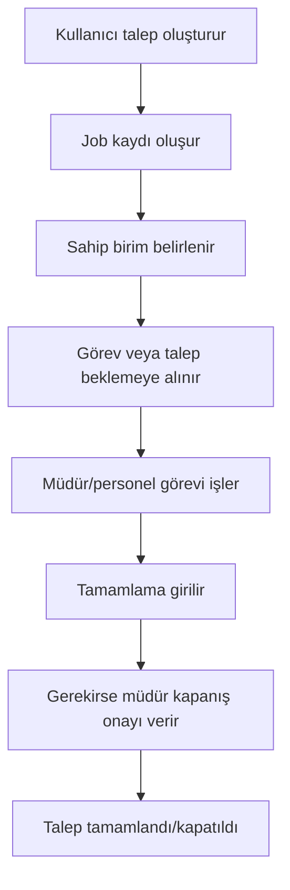
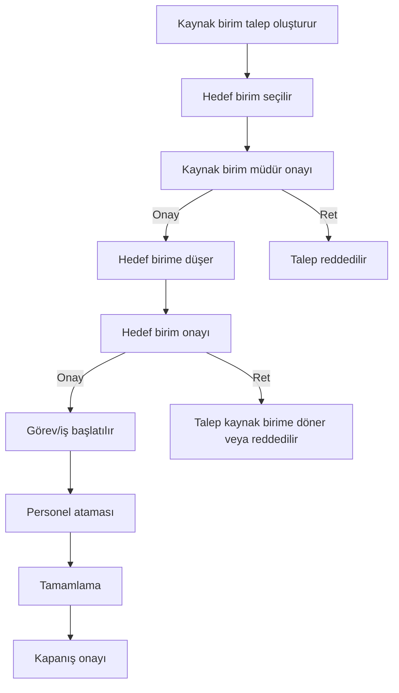
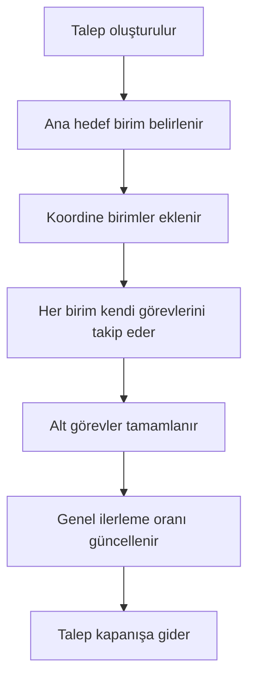
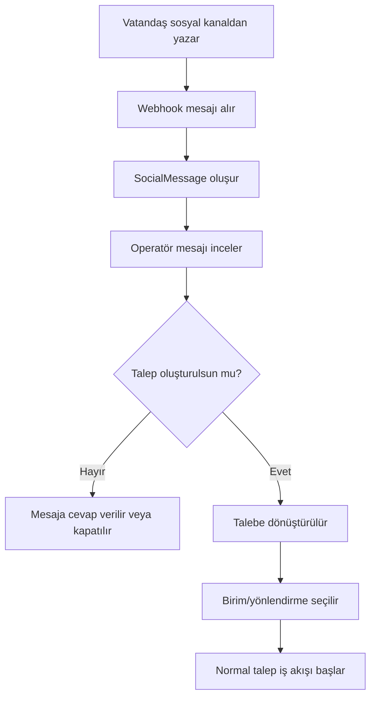
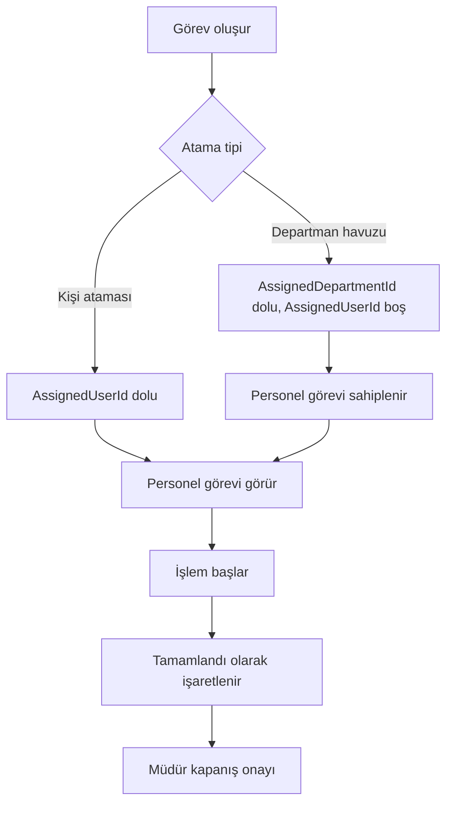
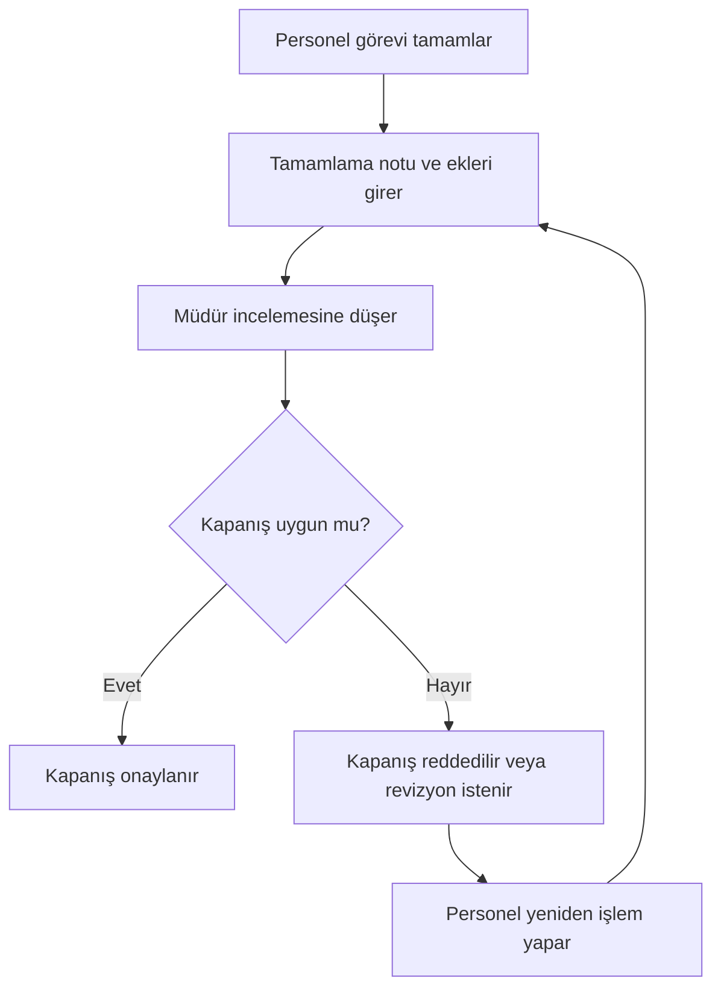
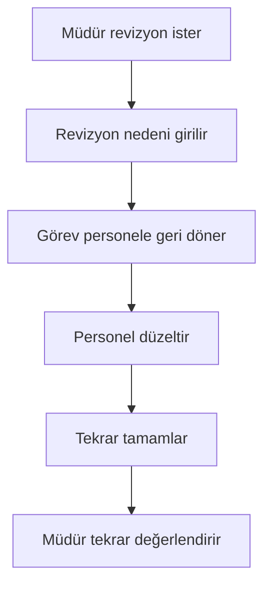
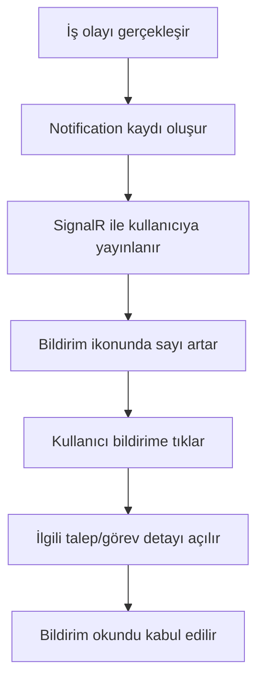

# İş Akışı ve Süreç Tasarım Dokümanı

Hazırlanma tarihi: 18 Haziran 2026

Bu doküman City Communication Center içindeki talep, görev, sosyal mesaj ve bildirim süreçlerini açıklar.

## 1. Süreç Alanları

Ana süreçler:

- İç birim talebi
- Dış birim talebi
- Vatandaş/sosyal mesajdan talep
- Görev atama ve tamamlama
- Müdür onay ve kapatma
- Süresi geçmiş talep/görev takibi
- Bildirim ve detay yönlendirme

## 2. İç Birim Talebi

İç birim talebi, kullanıcının kendi birimi içinde veya kendi sorumluluğundaki iş için açtığı taleptir.

Temel ekranlar:

- Talep Oluştur
- Taleplerim
- Görevlerim
- Birimdeki Görevler

## 3. Dış Birim Talebi

Dış birim talebi, talep sahibi birimden hedef birime yönlendirilen akıştır.

Temel ekranlar:

- Birimden Giden Talepler
- Birime Gelen Talepler
- Personelimin Görevleri

## 4. Koordinasyonlu Talep

Koordinasyonlu talepte birden fazla birim sürece dahil olur.

Koordine birimler `JobDepartment` kayıtlarıyla tutulur.

## 5. Vatandaş/Sosyal Mesaj Akışı

Kanallar:

- WhatsApp
- X
- Facebook
- Instagram
- Email
- WebForm
- Diğer

## 6. Görev Atama Akışı

Departman havuzu görevleri yalnızca ilgili departmandaki uygun personel tarafından sahiplenilebilir.

## 7. Görev Kapanış Akışı

## 8. Revizyon Akışı

Revizyon, tamamlanan veya kapanışa gelen işlerde ek düzeltme istendiğinde kullanılır.

## 9. Süresi Geçmiş Talep/Görev Mantığı

Bir talep veya görev şu koşullarda süresi geçmiş sayılır:

- Son tarih doludur.
- Son tarih şu andan küçüktür.
- Kayıt tamamlandı/kapatıldı durumunda değildir.

Bu kayıtlar ilgili ekranlarda özel filtrelerle gösterilir:

- Taleplerim > Son Tarihi Geçmiş Taleplerim
- Birime Gelen Talepler > Son Tarihi Geçmiş Talepler
- Birimden Giden Talepler > Son Tarihi Geçmiş Talepler

## 10. Bildirim Akışı

Bildirim kaynakları:

- Yeni görev
- Talep onayı
- Görev ataması
- Tamamlama
- Reddetme
- Revizyon
- Sosyal mesaj

## 11. İptal ve Geri Gönderme

İptal:

- Talep/görev artık işleme alınmayacaksa kullanılır.
- İptal nedeni girilmelidir.
- Audit log'da izlenmelidir.

Geri gönderme:

- Yanlış veya eksik talep hedef birim tarafından kaynak birime geri gönderilebilir.
- Açıklama girilmelidir.
- Kaynak birim düzeltme veya yeniden yönlendirme yapabilir.

## 12. İş Akışı Tasarım İlkeleri

- Kullanıcı yalnızca rolü ve birimi kapsamındaki kayıtları görmelidir.
- Departman havuzu görevleri açık kişi ataması olmadan bekleyebilir.
- Müdür/system admin yeniden atama yapabilir.
- Talep ve görev geçmişi audit log ile izlenmelidir.
- Sosyal mesajdan oluşan taleplerde kaynak bağlantısı korunmalıdır.
- Süresi geçmiş kayıtlar ayrı filtrelerle görünür olmalıdır.
